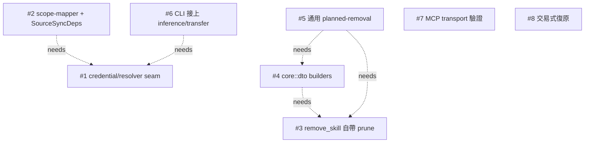

# aghub — CLI/App 能力一致性深化 Master Plan

> **目標**:讓 CLI 與 App(desktop/API)能力一致、更好用、整體錯誤大幅減少。
> **手法**:把分散在各表面的行為下沉到 core 的 deep module,讓 CLI/API 只當薄 adapter。
> **來源**:39-agent 研究 + 對抗式查證(33 findings)→ 8 deepening 候選 → 8-agent 計畫 + high-effort synthesis。
>
> **執行原則**:8 個獨立 PR,嚴格照 Phase 順序,每個 PR 各自過 3-platform test gate。**強烈偏好 incremental,不要 big-bang。**

## 執行摘要

Land the dependency-free core primitive #7 first (silent-flag-drop fix, zero conflicts, early green), then build the two foundation types in strict order: #3 extends the single RemovalOutcome with PruneStatus and absorbs the lock-prune, #4 builds the core::dto RemovalView/SkillView on top of it, and #5 generalizes the planned-removal seam to MCP/sub-agent through that one DTO — this chain guarantees ONE outcome type and ONE PathBuf->String mapper instead of the three copies live today. #8 (transactional recovery) slots after as its own npx-contract-reviewed PR. Then #1 establishes the final TokenResolver/Fetcher/credential-store shape by moving keyring code out of api, unblocking #2 (scope-mapper + SourceSyncDeps) and #6 (thin CLI surfaces) which both consume that resolver. This order minimizes merge conflict by forcing each shared foundation (RemovalOutcome, the resolver seam, core::dto, McpTransport::from_inputs, app_data_dir) to land exactly once before its consumers, and minimizes risk by keeping every phase an independently test-gated PR with the ts-rs and frozen-npx-contract checks isolated to the phases that touch them.

## 依賴圖



依賴邊說明:

- **#2 → #1**:SourceSyncDeps/scan_for_sync reuse the SAME Fetcher/TokenResolver trait objects #1 finalizes in skill-update/src/lib.rs; if #1 reshapes those signatures #2 must adopt the final shape, and CLI sync must use EnvThenKeyringResolver not a fresh env-only resolver.
- **#6 → #1**:CLI `inference add/update` consumes #1's API-key resolution (flag/stdin/env/keyring) + the shared app_data_dir() so keys are interoperable with desktop; without #1's resolver #6 would re-implement the fallback.
- **#4 → #3**:RemovalView::from(&RemovalOutcome) serializes the exact struct #3 extends with PruneStatus; #4 must build on the post-#3 RemovalOutcome, not a parallel one.
- **#5 → #3**:remove_mcp_planned/remove_sub_agent_planned construct the SAME RemovalOutcome/RemovalPlan #3 owns; if #3 moves/renames it #5 follows.
- **#5 → #4**:All three delete routes (skill/mcp/sub-agent) + CLI JSON map through the ONE RemovalView from #4; #5 drops the DeleteSkillByPathResponse reuse in favor of it.

## 共用地基(必須先各自落地一次,禁止出現第二份定義)

### 🧱 Resolver/Fetcher seam in skill-update (credentials module)

- **位置**:`crates/skill-update/src/credentials.rs (new) + crates/skill-update/src/lib.rs (TokenResolver/Fetcher traits)`
- **被哪些候選依賴**:#1, #2, #6
- **決策**:Create crates/skill-update/src/credentials.rs and finalize the TokenResolver/Fetcher trait shape in skill-update/src/lib.rs ONCE. Move SourceBindings + resolve_token_for_source + bind_source_to_credential + StoredCredential + the SERVICE/USER keyring consts out of crates/api (credentials/resolve.rs + routes/credentials.rs) and behind SourceCredentialStore. Collapse the two duplicated KeyringResolver structs (routes/sources.rs:173 + skills_update.rs) into ONE KeyringTokenResolver, and turn CLI's env-only EnvTokenResolver (source.rs:277) into EnvThenKeyringResolver. This is the resolver shape #2 and #6 both consume — its final trait signatures must exist before they build.

### 🧱 RemovalOutcome canonical struct + PruneStatus

- **位置**:`crates/core/src/skills/removal.rs (RemovalOutcome) + PruneStatus alongside it`
- **被哪些候選依賴**:#3, #4, #5
- **決策**:ONE definition of RemovalOutcome in crates/core/src/skills/removal.rs:393, extended with `prune: PruneStatus` (#3) where PruneStatus is the NotRun/Pruned(Vec<String>)/Failed(String) enum. #3 must land this extension first; #5 reuses the SAME struct verbatim for MCP/sub-agent (NOT a parallel type); #4 builds its wire DTO from this exact struct. Do not let #4 or #5 introduce a second outcome type. The prune logic moves INTO remove_skill_planned (today both delete callers call prune_scope_lock separately at skills.rs:1099 and CLI delete.rs).

### 🧱 core::dto module with RemovalView + SkillView

- **位置**:`crates/core/src/dto/{mod.rs,skill.rs,removal.rs} (new); ts-rs re-export newtypes stay in crates/api/src/dto`
- **被哪些候選依賴**:#4, #5
- **決策**:Create crates/core/src/dto/ as the single home for resource wire shapes. RemovalView::from(&RemovalOutcome) holds the ONE PathBuf->String + deleted_path/dry_run/needs_confirm derivation that today is duplicated in api delete_response_from_outcome (skills.rs:586) AND cli delete.rs json!{}. ts-rs export stays in api by re-export newtype: SkillResponse currently emits `source: ConfigSource | null` (ConfigSource = "global"|"project") and `agent`/all 10 fields — the move MUST preserve that exact generated TypeScript (crates/desktop/src/generated/dto/SkillResponse.ts) byte-for-byte after ts-rs+prettier. ConfigSource is `#[serde(skip)]` on Skill today, so SkillView::source serializes via a small lowercase repr, NOT by pulling api's dto::common::ConfigSource into core.

### 🧱 McpTransport::from_inputs + DEFAULT_REMOTE_TRANSPORT

- **位置**:`crates/core/src/models.rs`
- **被哪些候選依賴**:#7
- **決策**:One validating constructor in crates/core/src/models.rs (impl McpTransport) + a DEFAULT_REMOTE_TRANSPORT="streamable-http" const. Replaces the silent-drop branching in cli parse_mcp_transport (commands/mod.rs:18 drops --header on the command path and --env on the url path). CLI keeps parse_headers/parse_env_vars (clap string parsing) and delegates. Reuses the existing ConfigError::ValidationFailed variant — no new error variant. Independent primitive; any future MCP-construction site (API import/transfer) routes through it.

### 🧱 app_data_dir() shared helper

- **位置**:`crates/cli/src/commands/mod.rs`
- **被哪些候選依賴**:#1, #6
- **決策**:ONE copy of the app-data-dir resolver shared between CLI store construction and the credential work. It must match api's existing default_app_data_dir (api/lib.rs:43 — dirs::data_dir().unwrap_or_else(temp_dir).join("aghub")) so a keyring/inference key written by desktop is read by CLI. Keep it in crates/cli/src/commands/mod.rs. #1 owns how CLI resolves an API key (flag/stdin/env/keyring); #6 consumes that resolver rather than re-implementing the fallback.

## 跨候選風險

ts-rs generated-DTO drift (#4, #5, #7): the desktop TypeScript in crates/desktop/src/generated/dto/ is ts-rs-exported from api THEN prettier-formatted; `generate:dto` alone shows a spurious ~121-file diff, so each DTO-touching PR must run prettier before diffing and assert SkillResponse.ts/McpResponse.ts/RemovalResponse stay byte-identical (SkillResponse already emits source: ConfigSource|null + agent + 10 fields). Keep ts-rs export attrs in api re-export newtypes; do NOT pull api's dto::common::ConfigSource into core (ConfigSource is #[serde(skip)] on Skill — serialize via a small lowercase repr). Frozen npx round-trip contract (#8, and #2): the .agents Master+symlink layout, lock schemas, and folder hash must not change — #2 keeps install/lock-writing in core behind ConfigManager, and #8 must consolidate materialize_universal_master WITHOUT altering the on-disk layout (route it through the npx-skills-contract skill review). 3-platform test gate (release.yml runs ubuntu/macOS/Windows just test): incremental PRs each keep the gate green; watch macOS/Windows /var->/private canonicalize-prefix behavior in #3/#5 (removal containment) and #8 (stage/swap) where Linux-passing path-containment code has shipped platform bugs before. Single-definition discipline: RemovalOutcome (#3/#4/#5) and the resolver shape (#1/#2/#6) must each exist ONCE — the biggest merge-conflict risk is two candidates defining a parallel outcome type or a second resolver; the phase order forces the foundation to land first so siblings build on it. Big-bang vs incremental: strongly prefer incremental — 8 separate PRs in this order, each independently mergeable and test-gated; a big-bang PR would entangle the api->skill-update keyring move (#1) with the core dto move (#4) and make the ts-rs/npx review unauditable.

---

## 執行階段(build order)

## Phase 0 — independent core primitives (parallel, no shared deps)

- **候選**:#7　|　**可獨立 PR**:是
- **理由**:#7 (McpTransport::from_inputs + DEFAULT_REMOTE_TRANSPORT) touches only crates/core/src/models.rs + the thin CLI wrapper and depends on nothing. It is the cleanest standalone win (fixes a real silent-flag-drop bug) and conflicts with no other phase, so it ships first as its own PR to bank an early green and de-risk the test gate. #8 is also dependency-free but is deferred to Phase 4 because it touches the frozen npx contract and wants the install primitives settled.

### 候選 #7:Validating MCP transport constructor: reject dropped flags, add --timeout, pin one shared default　`[M]`

- **Deep module**:McpTransport::from_inputs — a single validating constructor in core models.rs (replacing the CLI-local parse_mcp_transport), plus a DEFAULT_REMOTE_TRANSPORT constant
- **位置**:`crates/core/src/models.rs (impl McpTransport); the thin CLI wrapper stays in crates/cli/src/commands/mod.rs but delegates`

**目前狀態(已用 codegraph 查證):**

> parse_mcp_transport lives at crates/cli/src/commands/mod.rs:18, signature (command: Option<String>, url: Option<String>, transport_type: &str, headers: Vec<String>, env_vars: Vec<String>, existing_timeout: Option<u64>) -> anyhow::Result<Option<McpTransport>>. ONLY 2 callers: crates/cli/src/commands/add.rs:92 (passes None for timeout) and crates/cli/src/commands/update.rs:69 (passes existing_timeout extracted from the existing transport at update.rs:62-66). BUGS confirmed in source: the stdio (--command) branch builds McpTransport::Stdio and silently ignores `headers` and `transport_type`; the url branch silently ignores `env_vars`; there is NO --timeout CLI flag. parse_env_vars (mod.rs:65, KEY=VALUE, splitn 2 on '=') and parse_headers (mod.rs:83, KEY:VALUE, splitn 2 on ':', trims) return Option<HashMap>. Commands::Add (main.rs:82-141) and Commands::Update (main.rs:143-188) both declare `transport: String` with #[arg(default_value=\"streamable-http\")] (lines 107 and 161), plus --header (Vec), -e/--env (Vec), -c/--command, -u/--url in clap group \"mcp_config\". add::execute (add.rs:26) and update::execute (update.rs:10) take these as params; main.rs dispatches at 452 (add) and 480 (update). McpServer (crates/core/src/models.rs:76) has fields name, enabled, transport: McpTransport, timeout: Option<u64> (SERVER-level, distinct from per-transport timeout), config_source. CLI never sets McpServer.timeout (uses McpServer::new at add.rs:101 which sets timeout:None). McpTransport (models.rs:103) is a serde tag=\"type\" snake_case enum {Stdio{command,args,env:Option<HashMap>,timeout:Option<u64>}, Sse{url,headers:Option<HashMap>,timeout}, StreamableHttp{url,headers,timeout}} with non-validating constructors stdio/stdio_with_env/sse/sse_with_headers/streamable_http/streamable_http_with_headers (none take/validate timeout — all set timeout:None). ConfigError (crates/core/src/errors.rs, re-exported) has ValidationFailed variant. API side: crates/api/src/dto/mcp.rs has TransportDto (same 3-variant tagged enum, From<&McpTransport> and From<TransportDto> for McpTransport, both pure field copies, NO validation), CreateMcpRequest{name,transport:TransportDto,timeout:Option<u64>} -> McpServer (from at :118), UpdateMcpRequest{name,transport,enabled,timeout}.apply_to (at :139). API routes create_mcp (mcps.rs:120) does McpServer::from(body) then add_mcp; update_mcp (mcps.rs:169) does apply_to then update_mcp. The API enum-tagged DTO cannot express command+url or stray headers-on-stdio (the gap is CLI-only), so API validation reduces to timeout>0; the shared-default-transport concern is the divergent 'streamable-http' literal. add_mcp/update_mcp (crates/core/src/manager/mcp.rs:9,31) just dedup-check and save. No existing test covers parse_mcp_transport (codegraph: 'no covering tests found').

**Deep module 介面(小介面,兩表面共用):**

```rust
// in crates/core/src/models.rs
pub const DEFAULT_REMOTE_TRANSPORT: &str = "streamable-http";

/// One validating constructor for both surfaces. Rejects incompatible
/// flag combinations instead of silently dropping them, and validates
/// timeout. Returns ConfigError::ValidationFailed on bad input.
impl McpTransport {
    pub fn from_inputs(
        command: Option<String>,
        url: Option<String>,
        transport_type: &str,   // only consulted on the url path
        headers: Option<HashMap<String,String>>,
        env: Option<HashMap<String,String>>,
        timeout: Option<u64>,
    ) -> crate::errors::Result<Option<McpTransport>>;
}
// Rules enforced:
//  - command + url both set -> ValidationFailed (clap already groups these,
//    but core re-checks so the API path is covered too).
//  - command set: env allowed; headers MUST be empty (else ValidationFailed:
//    "--header is only valid with --url"); transport_type ignored.
//  - url set: headers allowed; env MUST be empty (else ValidationFailed:
//    "--env is only valid with --command"); transport_type must be one of
//    {"sse","streamable-http"} (else ValidationFailed).
//  - timeout == Some(0) -> ValidationFailed ("timeout must be > 0").
//  - neither command nor url -> Ok(None) (caller decides if that's an error).

// CLI wrapper signature is UNCHANGED so call sites barely move:
// crates/cli/src/commands/mod.rs
// pub fn parse_mcp_transport(command, url, transport_type, headers: Vec<String>,
//   env_vars: Vec<String>, timeout: Option<u64>) -> anyhow::Result<Option<McpTransport>>
// now: parse Vec->map via existing parse_headers/parse_env_vars, then delegate
// to McpTransport::from_inputs, mapping ConfigError -> anyhow.
```

**移到接縫後面的東西:** The branching + (currently absent) compatibility/timeout validation moves from the CLI-local parse_mcp_transport into McpTransport::from_inputs in core. The CLI keeps parse_headers/parse_env_vars (KEY:VALUE / KEY=VALUE string parsing — clap-format concerns) and just delegates. The shared transport-type default string moves to a core const so CLI clap default, API DTO, and desktop can all reference the same value rather than re-declaring 'streamable-http' independently.

#### Task 1: [#7] Add DEFAULT_REMOTE_TRANSPORT const + McpTransport::from_inputs validating constructor in core

檔案:`crates/core/src/models.rs`

- [ ] Add `pub const DEFAULT_REMOTE_TRANSPORT: &str = "streamable-http";` near the McpTransport enum.
- [ ] Add `impl McpTransport { pub fn from_inputs(command, url, transport_type:&str, headers:Option<HashMap<String,String>>, env:Option<HashMap<String,String>>, timeout:Option<u64>) -> crate::errors::Result<Option<McpTransport>> }`.
- [ ] Validate timeout first: if matches!(timeout, Some(0)) return Err(ConfigError::validation_failed("timeout must be greater than 0")). (use whatever ValidationFailed constructor errors.rs exposes — confirm exact fn name via codegraph_node on ConfigError before writing).
- [ ] Branch: if command.is_some() && url.is_some() -> ValidationFailed("--command and --url are mutually exclusive").
- [ ] command branch: if headers.is_some() (non-empty) -> ValidationFailed("--header is only valid with --url"); transport_type is ignored; split command on whitespace (move the existing split/empty-check logic here), empty -> ValidationFailed("command cannot be empty"); build Stdio{command,args,env,timeout}.
- [ ] url branch: if env.is*some() -> ValidationFailed("--env is only valid with --command"); match transport_type: "sse"=>Sse, "streamable-http"=>StreamableHttp, *=>ValidationFailed(format!("unknown transport type '{transport_type}' (expected sse or streamable-http)")); build with headers,timeout.
- [ ] neither -> Ok(None).
- [ ] Keep the per-transport `timeout` field populated from the arg (this is the existing behavior the CLI already relied on via existing_timeout).
- [ ] Run `just fmt` (hard tabs) and ensure 80-col.

測試:

- [ ] crates/core/src/models.rs #[cfg(test)] mod tests: add unit tests next to test_mcp_server_with_timeout — from_inputs_stdio_rejects_headers, from_inputs_url_rejects_env, from_inputs_rejects_command_and_url, from_inputs_rejects_zero_timeout, from_inputs_unknown_transport_type_errs, from_inputs_url_default_streamable_and_sse_ok, from_inputs_none_when_no_command_or_url, from_inputs_stdio_empty_command_errs.

#### Task 2: [#7] Rewrite CLI parse_mcp_transport to parse strings then delegate; add --timeout flag to Add/Update

檔案:`crates/cli/src/commands/mod.rs`, `crates/cli/src/main.rs`, `crates/cli/src/commands/add.rs`, `crates/cli/src/commands/update.rs`

- [ ] mod.rs: change parse_mcp_transport to: build headers via parse_headers(headers), env via parse_env_vars(env_vars), then call McpTransport::from_inputs(command,url,transport_type,headers,env,timeout).map_err(|e| anyhow::anyhow!(e.to_string())). Rename the last param from existing_timeout to timeout. Keep parse_headers/parse_env_vars as-is (string-format parsing belongs in CLI).
- [ ] main.rs Commands::Add: add `/// For MCP: request timeout in seconds` `#[arg(long, value_name="SECONDS")] timeout: Option<u64>,`. Same for Commands::Update. Optionally set the transport clap default_value to reference the core const via a tiny helper (or leave the literal but add a comment pointing at DEFAULT_REMOTE_TRANSPORT — clap default_value needs a &'static str; simplest is `default_value = aghub_core::models::DEFAULT_REMOTE_TRANSPORT`).
- [ ] main.rs dispatch: thread `timeout` into add::execute and update::execute argument lists (both already #[allow(too_many_arguments)]).
- [ ] add.rs execute: add `timeout: Option<u64>` param; in the Mcps arm pass it as the last arg to parse_mcp_transport (replacing the literal `None`). MCP server-level McpServer.timeout stays None (per-transport timeout is what callers expect; do not also set server-level unless desired — keep minimal).
- [ ] update.rs execute: add `timeout: Option<u64>` param; replace the existing_timeout-extraction block (lines 62-66) usage so the new --timeout, when provided, wins, else fall back to existing per-transport timeout. Concretely: compute let effective_timeout = timeout.or(existing_timeout); pass effective_timeout to parse_mcp_transport. Keep the existing_timeout extraction match.
- [ ] just fmt + just lint (clippy -D warnings; from_inputs has many args — if clippy flags too_many_arguments on from_inputs add #[allow(clippy::too_many_arguments)]).

測試:

- [ ] crates/cli/tests/cli_tests.rs: add end-to-end assert_cmd cases — `add mcp --command "x" --header A:B` exits non-zero with message about --header only valid with --url; `add mcp --url http://h --env K=V` exits non-zero (--env only with --command); `add mcp --command "x" --url http://h` rejected (clap group already does this — assert the existing behavior still holds); `add mcp --url http://h --timeout 0` rejected; `add mcp --url http://h --timeout 30` succeeds and the printed JSON transport contains timeout:30; `add mcp --url http://h --transport bogus` rejected. Mirror one update case (`update mcp <name> --timeout 45`).

#### Task 3: [#7] Add timeout>0 validation on the API/DTO path so the surfaces agree

檔案:`crates/api/src/dto/mcp.rs`

- [ ] The tagged DTO cannot express command+url or stray-headers, so only the timeout rule is shared. Add a small validate() on CreateMcpRequest and UpdateMcpRequest (or validate inside create_mcp/update_mcp routes) that rejects timeout==Some(0) and any per-transport timeout==Some(0) inside TransportDto, returning ApiError UnprocessableEntity with code VALIDATION_FAILED.
- [ ] Wire it: in crates/api/src/routes/mcps.rs create_mcp (mcps.rs:120) call req.validate()? before McpServer::from; in update_mcp (mcps.rs:169) call body.validate()? before apply_to. (Confirm ApiError UnprocessableEntity constructor shape via the existing check_mcp_supported at mcps.rs:21.)
- [ ] Do NOT regenerate ts-rs DTOs unless a #[derive(TS)] struct's SHAPE changes — adding a validate() method changes no fields, so no DTO regen needed. Only if you add a new field run `bun run generate:dto` then prettier (see risks).

測試:

- [ ] crates/api integration test (same module/style as test_create_mcp_rejects_pi_agent referenced in mcps.rs tests): test_create_mcp_rejects_zero_timeout -> 422; test_update_mcp_rejects_zero_timeout -> 422.

**候選 #7 風險:** npx round-trip contract: NOT touched — this changes input validation/construction only; serialized McpTransport JSON shape (tag=\"type\", fields) is unchanged, so on-disk configs and any lock interplay are unaffected. ts-rs DTO regen: not triggered by adding validate() methods (no field shape change); ONLY if a field is added must you run `bun run generate:dto` and THEN prettier (generate:dto alone shows a spurious ~121-file diff — per memory note, run prettier before diffing). clippy -D warnings: from_inputs takes 6 args -> likely clippy::too_many_arguments; add the allow attr (the existing CLI fns already use it). Confirm the exact ConfigError::ValidationFailed constructor name via codegraph_node ConfigError before writing (avoid inventing validation_failed if the real fn differs). 3-platform release test gate: pure-logic changes, no platform-specific paths, low risk — but the new cli_tests.rs assert_cmd cases run on all 3 platforms; keep error-message assertions matching on a stable substring, not full strings, to avoid Windows path/quote flakiness. ADR-0001 transactional rename: NOT in scope (MCP, not skill rename) — no interaction. Behavior change risk: rejecting previously-silently-dropped flags is technically a stricter contract; acceptable and is the explicit goal (errors instead of silent data loss), and the dropped flags never did anything, so no working invocation breaks.

---

## Phase 1 — RemovalOutcome.prune in core (the outcome-shape foundation)

- **候選**:#3　|　**可獨立 PR**:是
- **理由**:#3 extends the single RemovalOutcome struct with PruneStatus and pulls the lock-prune INTO remove_skill_planned. This is the outcome shape #4 serializes and #5 reuses, so it MUST precede both. Self-contained to crates/core (removal.rs + manager/skill.rs) plus dropping the now-redundant prune_scope_lock call in the two delete callers — ships independently.

### 候選 #3:remove_skill_planned owns the lock prune and returns a structured prune outcome　`[M]`

- **Deep module**:ConfigManager::remove_skill_planned (deepened) + RemovalOutcome.prune
- **位置**:`crates/core/src/manager/skill.rs (mutates) and crates/core/src/skills/removal.rs (RemovalOutcome + new PruneStatus type)`

**目前狀態(已用 codegraph 查證):**

> REAL symbols (codegraph-verified):\n\n• crates/core/src/manager/skill.rs:453 `remove_skill_planned(&mut self, name, all_agents, dry_run, confirm) -> Result<removal::RemovalOutcome>`. Doc-comment line 451-452 explicitly says \"The lock is NOT pruned here — pruning is a separate, explicit step (skills::prune)\". On the executed branch (line 489+) it runs execute*removal, reflects report into plan.paths/skipped, drops the in-memory skill, returns `RemovalOutcome { plan, executed: true }`. Non-executed branch returns `{ plan, executed: false }`.\n\n• crates/core/src/skills/removal.rs:393 `struct RemovalOutcome { pub plan: RemovalPlan, pub executed: bool }`. Only 3 referencers: remove_skill_planned, delete_skill_by_path, delete_response_from_outcome.\n\n• crates/core/src/skills/prune.rs:120 `prune_lock_scanning(scope: PruneScope, project_root: Option<&Path>) -> Result<Vec<String>, PruneError>`. PruneScope enum (line 29): Global|Project. PruneError (line 38): Scan|Io|MissingProjectRoot, all Display. Returns pruned keys Vec<String>.\n\n• CLI call site crates/cli/src/commands/delete.rs:41-70: calls remove_skill_planned, then `if outcome.executed` does a 3-arm match on options.scope (GlobalOnly/ProjectOnly/Both) calling `let * = prune*lock_scanning(...)`— Result discarded. JSON (line 83-94) emits type/name/dryRun/executed/needsConfirm/paths/skipped (no prune field today).\n\n• API wrapper crates/api/src/routes/skills.rs:519`prune_scope_lock(resource_scope, project_root)`— same 3-arm matches(GlobalOnly|Both / ProjectOnly|Both) wrapping`let * = prune_lock_scanning(...)`.\n\n• API call site 1 crates/api/src/routes/skills.rs:1064 delete_skill: after remove_skill_planned, `if outcome.executed { prune_scope_lock(resource_scope, project_root.as_deref()); }` then delete_response_from_outcome(outcome).\n\n• API call site 2 crates/api/src/routes/skills.rs:197 delete_skill_by_path: has TWO prune_scope_lock calls — line 445 (non-link Copy branch that builds its OWN RemovalOutcome at 446-451, NOT via remove_skill_planned) and line 457 (canonical_layout branch via remove_skill_planned). delete_response_from_outcome (line 586) builds DeleteSkillByPathResponse and does NOT read prune.\n\n• ConfigManager (crates/core/src/manager/mod.rs:16) holds pub(crate) scope: ResourceScope and project_root: Option<PathBuf>. CLI builds it via with_scope(adapter, use_global, project_root, scope) at main.rs:398 with the SAME scope/project_root it later passes in DeleteOptions — so self.scope/self.project_root already equal the wrappers' inputs. API builds via build_manager_from_resolved from the same resolved scope. So the manager already owns the scope+root the prune needs; no new params required.\n\n• ResourceScope (crates/agents/src/models.rs:242): GlobalOnly|ProjectOnly|Both.

**Deep module 介面(小介面,兩表面共用):**

```rust
// crates/core/src/skills/removal.rs
#[derive(Debug, Clone, PartialEq, Eq)]
pub enum PruneStatus {
	/// No prune attempted (dry-run / nothing executed).
	NotRun,
	/// Prune ran; Vec is the pruned lock keys (may be empty = nothing orphaned).
	Pruned(Vec<String>),
	/// Prune was attempted but failed; lock left unchanged. String = reason.
	Failed(String),
}
impl Default for PruneStatus { fn default() -> Self { PruneStatus::NotRun } }

pub struct RemovalOutcome {
	pub plan: RemovalPlan,
	pub executed: bool,
	pub prune: PruneStatus, // NEW
}

// crates/core/src/manager/skill.rs — signature UNCHANGED, behavior deepened:
pub fn remove_skill_planned(
	&mut self,
	name: &str,
	all_agents: bool,
	dry_run: bool,
	confirm: bool,
) -> Result<crate::skills::removal::RemovalOutcome>
```

**移到接縫後面的東西:** The post-delete lock prune. Today both surfaces compute scope→PruneScope and call prune*lock_scanning themselves, discarding the Result with `let *`. After this change remove_skill_planned, on the executed branch, derives PruneScope from self.scope (GlobalOnly→Global, ProjectOnly→Project, Both→both) using self.project_root, calls prune_lock_scanning, and records the result in RemovalOutcome.prune as Pruned(keys)/Failed(reason). Callers no longer prune.

#### Task 4: [#3] Add PruneStatus + prune field to RemovalOutcome

檔案:`crates/core/src/skills/removal.rs`

- [ ] Add `pub enum PruneStatus { NotRun, Pruned(Vec<String>), Failed(String) }` with derives Debug, Clone, PartialEq, Eq and a manual or derived Default = NotRun (impl Default returning NotRun; do not #[default] on a non-unit-friendly enum unless all simple — NotRun is unit so #[derive(Default)] + #[default] on NotRun works and is shorter).
- [ ] Add `pub prune: PruneStatus` to struct RemovalOutcome.
- [ ] Every existing `RemovalOutcome { plan, executed }` literal will now fail to compile (good — compiler finds all sites). There are 3: remove_skill_planned (2 literals: lines ~491 and ~525) and delete_skill_by_path (2 literals: lines ~446-451 dry-run preview and ~446 executed Copy branch). Fix the core ones in this task's sibling task; the API ones use `..` default — set them to PruneStatus::NotRun for the dry-run preview literal and let the executed Copy branch be handled in the API task.

測試:

- [ ] No new test here; type compiles. Existing prune.rs unit tests (crates/core/src/skills/prune.rs tests mod, e.g. prune_lock_global_drops_orphan_keeps_present) are unaffected — prune_lock_scanning signature unchanged.

#### Task 5: [#3] Move the prune into remove_skill_planned and record PruneStatus

檔案:`crates/core/src/manager/skill.rs`

- [ ] At top of fn add `use crate::skills::prune::{prune_lock_scanning, PruneScope};` (removal is already `use`d).
- [ ] Non-executed early return (~line 491): set `prune: PruneStatus::NotRun`.
- [ ] Executed branch (~line 525, after the in-memory skill removal): compute prune from self.scope + self.project_root. Helper inline: for GlobalOnly call prune_lock_scanning(Global, None); ProjectOnly call (Project, self.project_root.as_deref()); Both call Global then Project. Collect into a single PruneStatus: on the first Err, store Failed(err.to_string()); on success store Pruned(keys) — for Both, concatenate the two key vecs and Failed wins if either errors. Keep it a small match, ~15 lines.
- [ ] Set `prune` in the executed RemovalOutcome literal.
- [ ] Update the doc-comment at lines 450-452: it currently says the lock is NOT pruned here. Change to state that on execution the per-scope lock IS pruned and the result is reported in RemovalOutcome.prune (NotRun on dry-run, Pruned/Failed on execute); prune failure is non-fatal (lock left unchanged, deletion already happened).
- [ ] ponytail note: keep PruneScope::Project with a None project_root impossible — guard by only pruning Project when self.project_root.is_some(), matching today's CLI/API behavior which skipped project prune without a root.

測試:

- [ ] crates/core/tests/integration*tests.rs (or a focused unit test in manager/skill.rs tests mod if one exists): add `remove_skill_planned_prunes_lock_on_execute` — build an isolated TestConfig with a locked skill, install+lock it, remove_skill_planned(name, false, dry_run=false, confirm=true), assert outcome.executed && matches!(outcome.prune, PruneStatus::Pruned(*)) and the lock entry is gone. Use the existing TestConfig helper + set_skills_path_override pattern.
- [ ] Add `remove_skill_planned_dry_run_leaves_prune_notrun`: dry_run=true → assert outcome.prune == PruneStatus::NotRun and lock untouched.

#### Task 6: [#3] Drop the CLI prune wrapper; surface prune in JSON

檔案:`crates/cli/src/commands/delete.rs`

- [ ] Delete the `use aghub_core::skills::prune::{prune_lock_scanning, PruneScope};` import (line 4) — no longer needed.
- [ ] Delete the entire `if outcome.executed { match options.scope { ... } }` block (lines 47-70).
- [ ] Optionally add a `pruned`/`pruneError` field to the emitted JSON from outcome.prune so the CLI reports what the API can too — e.g. on Pruned(keys) add `"prunedLockEntries": keys`, on Failed(reason) add `"pruneError": reason`. Keep additive (don't remove existing fields).
- [ ] DeleteOptions still carries scope/project_root; they are now unused by the prune path but `scope`/`project_root` may be referenced elsewhere — if they become fully unused, drop them from DeleteOptions and the main.rs construction (main.rs:504) to avoid dead_code/clippy. Verify with `cargo build -p aghub-cli` whether they're still read; the delete fn body after removal no longer reads either, so remove both fields from DeleteOptions and the two lines at main.rs:505-506.

測試:

- [ ] crates/cli/tests/cli_tests.rs: the delete path is exercised by existing tests; add/extend one asserting that after `delete skills <name> --yes` the JSON still emits executed:true and (new) prunedLockEntries is present. If no existing delete-skill CLI test, add `delete_skill_yes_prunes_and_reports` building a temp skill+lock via assert_cmd.

#### Task 7: [#3] Drop prune_scope_lock; rewire both API delete sites

檔案:`crates/api/src/routes/skills.rs`

- [ ] delete_skill (line 1064): remove the `if outcome.executed { prune_scope_lock(...) }` block — the manager already pruned. Keep delete_response_from_outcome(outcome).
- [ ] delete_skill_by_path canonical_layout branch (line 454-460): remove the `if outcome.executed { prune_scope_lock(...) }` block — manager prunes.
- [ ] delete*skill_by_path non-link Copy branch (lines 414-451): this branch does NOT go through remove_skill_planned (it builds its own RemovalPlan + execute_removal). KEEP a prune here, because nothing else prunes this path. Replace the `prune_scope_lock(resource_scope, project_root.as_deref())` call (line 445) with a direct `let * = prune_lock_scanning(PruneScope::for the scope, ...)` OR keep prune_scope_lock JUST for this one branch. Lazy choice: keep prune_scope_lock as a private fn (it still has exactly 1 remaining caller) — do NOT delete it. Set the dry-run preview RemovalOutcome literal (line 421-426) prune: PruneStatus::NotRun and the executed Copy literal (446-451) prune: PruneStatus::NotRun (or Pruned from the prune call's result if you want symmetry — NotRun is fine since delete_response_from_outcome ignores prune).
- [ ] delete_response_from_outcome (line 586): no change required (it doesn't read prune). Optionally surface prune into DeleteSkillByPathResponse if the DTO is extended — NOT required for this candidate; skip to avoid ts-rs churn.
- [ ] Verify prune_scope_lock now has exactly 1 caller (the Copy branch) — if you instead inlined it, delete the fn. Pick whichever leaves zero dead code.

測試:

- [ ] crates/api/src/routes/skills.rs tests mod: existing delete_by_path_confirm_deletes_dir / delete_by_path_keeps_master_referenced_by_another_agent_symlink / delete_by_path_symlinked_install_uses_canonical_layout must still pass (they assert disk state, not prune). Add `delete_skill_executes_and_lock_pruned`: via the delete_skill handler with confirm, assert the lock entry is gone after — proves the manager-side prune fires through the API path. Use with_isolated_env like the existing by_path tests.

**候選 #3 風險:** • npx round-trip contract: prune_lock_scanning is unchanged — it still calls skill::retain_locked_skills / retain_local_locked_skills (the npx-compatible lock writers). Moving WHERE it's called from (manager vs caller) does not alter lock-file bytes or the .agents layout, so the frozen contract is preserved. Verify no double-prune: today the executed path prunes once per surface; after the change it prunes once inside the manager — must NOT also prune in the caller (the whole point). The ONE branch that still prunes in the caller is delete_skill_by_path's non-link Copy branch (it bypasses the manager); leaving its prune in place is correct, removing it would regress.\n• ts-rs DTO regeneration: NOT needed for this candidate — PruneStatus stays internal to aghub-core; neither DeleteSkillByPathResponse nor the CLI JSON is a ts-rs type the desktop binds beyond what exists. If you DO choose to surface prune in DeleteSkillByPathResponse, that struct may be ts-rs-exported — then run `bun run generate:dto` then prettier (generated DTOs are prettier-formatted; a bare generate shows a spurious ~121-file diff). Recommended: skip the DTO change, keep the candidate minimal.\n• clippy -D warnings: removing the CLI prune block may orphan the prune import (remove it) and the DeleteOptions.scope/project_root fields (remove if unused, else dead_code denies the build). Run `just lint`.\n• 3-platform release test gate: the new core/api/cli tests must pass on ubuntu/macOS/Windows. The lock-prune tests are fs-based and HOME-redirected; the existing by-path tests already document that Windows junction-delete tests are intentionally omitted — keep new tests on the same isolation pattern (with_isolated_env / TestConfig + env_lock) and avoid unix-only symlink assumptions unless #[cfg(unix)]-gated.\n• ADR-0001 (transactional universal rename): not touched — this candidate only changes removal+prune, not rename. No interaction.\n• Behavior parity: confirm self.scope == the scope the wrappers used. Verified: CLI with_scope(...scope) at main.rs:398 + DeleteOptions{scope} are the same value; API build_manager_from_resolved derives from the same resolved scope as resource_scope. Edge: ResourceScope::Both — the manager must replicate the wrapper's Both behavior (prune Global AND Project); the CLI/API wrappers both handled Both, so the manager match must too.

---

## Phase 2 — core::dto builders (RemovalView + SkillView)

- **候選**:#4　|　**可獨立 PR**:是
- **理由**:#4 builds the wire DTOs ON TOP of the Phase-1 RemovalOutcome (deps [3]) and consolidates the duplicated PathBuf->String/deleted_path logic from api + cli. Must land before #5 so all three resource deletes map through ONE RemovalView. Highest-risk for ts-rs drift (must keep SkillResponse.ts byte-identical), so it ships alone with a prettier-after-generate diff check in the PR.

### 候選 #4:Shared resource DTO builders in core: one RemovalOutcome→DTO and one SkillResponse the CLI and API both serialize　`[M]`

- **Deep module**:aghub_core::dto (skill + removal response builders)
- **位置**:`crates/core/src/dto/mod.rs (new module): dto/skill.rs (SkillView), dto/removal.rs (RemovalView). ts-rs export stays in api/dto by re-export newtypes (see risks).`
- **依賴**:#3, #5

**目前狀態(已用 codegraph 查證):**

> VERIFIED via codegraph. crates/api/src/dto/skill.rs:72 SkillResponse{name,enabled,source_path,canonical_path,description,author,version,tools,source:Option<ConfigSource>,agent:Option<String>} (snake_case, #[derive(Serialize,TS)]); From<&Skill> + From<Skill> + from_agent_skill(skill,agent_id). dto/skill.rs:327 DeleteSkillByPathResponse{success,dry_run,executed,needs_confirm,paths:Vec<String>,skipped:Vec<String>,deleted_path:Option<String>,error,validation_errors} (#[derive(Default,Serialize,TS)], snake_case). delete_response_from_outcome(outcome: aghub_core::skills::removal::RemovalOutcome)->DeleteSkillByPathResponse at routes/skills.rs:586 stringifies plan.paths/plan.skipped and computes deleted_path=executed.then(paths.first). create_skill (skills.rs:946) + import_skill (:968) return SkillResponse::from(&skill); no native-reader advisory anywhere in API. CLI: describe::execute (main.rs:601-639) and add::execute (commands/add.rs) BOTH print serde_json::to_string_pretty(&skill) of the RAW aghub_core::models::Skill (models.rs:33; serde snake_case, content #[serde(skip)], config_source #[serde(skip)]) — so describe/add are already snake_case raw Skill, NOT camelCase; the prompt's 'camelCase' applies only to delete. CLI delete::execute (commands/delete.rs:83-94) hand-builds serde_json::json!{type,name,dryRun:!executed,executed,needsConfirm,paths,skipped} (camelCase) from manager.remove_skill_planned(...)->RemovalOutcome. Advisory exists only in CLI add as stderr note via manager.skill_target_is_native_reader() (manager/skill.rs:724, returns LinkNeed::NativeReader). RemovalOutcome{plan:RemovalPlan,executed} + RemovalPlan{layout,paths:Vec<PathBuf>,skipped:Vec<PathBuf>,needs_confirm} at core/src/skills/removal.rs:393/176. ConfigSource enum (core models) maps to api dto/common.rs ConfigSource (Global/Project, lowercase). ts-rs exports drive crates/desktop/src/generated/dto/\*.ts (SkillResponse.ts etc); SkillResponse has 4 desktop callers (skills.ts, skill-detail-helpers.ts) keyed on snake_case fields.

**Deep module 介面(小介面,兩表面共用):**

```rust
// crates/core/src/dto/skill.rs
#[derive(Debug, Clone, Serialize)]
pub struct SkillView {
  pub name: String,
  pub enabled: bool,
  pub source_path: Option<String>,
  pub canonical_path: Option<String>,
  pub description: Option<String>,
  pub author: Option<String>,
  pub version: Option<String>,
  pub tools: Vec<String>,
  pub source: Option<crate::models::ConfigSource>,
  pub agent: Option<String>,
  /// advisory: target agent is a NativeReader (.agents master only, no per-agent link)
  pub native_reader: bool,
}
impl From<&crate::models::Skill> for SkillView { /* ... */ }
impl SkillView { pub fn with_agent(self, agent_id:&str)->Self; pub fn with_native_reader(self, v:bool)->Self; }

// crates/core/src/dto/removal.rs
#[derive(Debug, Clone, Serialize)]
pub struct RemovalView {
  pub success: bool,
  pub dry_run: bool,
  pub executed: bool,
  pub needs_confirm: bool,
  pub paths: Vec<String>,
  pub skipped: Vec<String>,
  pub deleted_path: Option<String>,
}
impl From<&crate::skills::removal::RemovalOutcome> for RemovalView { /* stringifies PathBuf, derives deleted_path */ }
```

**移到接縫後面的東西:** PathBuf->String stringification + deleted_path/dry_run/needs_confirm derivation currently duplicated in api delete_response_from_outcome() AND cli delete.rs json!{} moves into RemovalView::from(&RemovalOutcome). Skill->wire field copying currently in api SkillResponse::From<&Skill> moves into SkillView::From<&Skill>. The native_reader advisory (today only cli add stderr note via skill_target_is_native_reader) becomes a DTO field both surfaces can emit.

#### Task 8: [#4] Add core dto module with RemovalView + SkillView (no ts-rs in core)

檔案:`crates/core/src/dto/mod.rs`, `crates/core/src/dto/skill.rs`, `crates/core/src/dto/removal.rs`, `crates/core/src/lib.rs`

- [ ] Create crates/core/src/dto/mod.rs: `pub mod skill; pub mod removal;` and re-export `pub use skill::SkillView; pub use removal::RemovalView;`
- [ ] Add `pub mod dto;` to crates/core/src/lib.rs.
- [ ] dto/removal.rs: define RemovalView (fields per interface, #[derive(Debug,Clone,Serialize)] — DO NOT add ts-rs here, core has no ts-rs dep; serde defaults to snake_case which matches DeleteSkillByPathResponse). impl From<&crate::skills::removal::RemovalOutcome>: success=true, dry_run=!outcome.executed, executed=outcome.executed, needs_confirm=outcome.plan.needs_confirm, paths/skipped via p.display().to_string(), deleted_path=outcome.executed.then(||outcome.plan.paths.first().map(|p|p.display().to_string())).flatten(). This is the SHARED removal-outcome wire builder (sharedFoundation with #3/#5).
- [ ] dto/skill.rs: define SkillView (fields per interface + native_reader:bool) #[derive(Debug,Clone,Serialize)] snake_case. impl From<&Skill> copying fields, source=s.config_source (NOTE: core models::ConfigSource derives Serialize? verify; if not, leave source as-is — it already serializes for the manager). native_reader defaults false. Add with_agent / with_native_reader builders.
- [ ] Keep PathBuf->String + deleted_path logic ONLY here; this is the single definition.

測試:

- [ ] crates/core/src/dto/removal.rs #[cfg(test)]: removal_view_dry_run_sets_flags_and_no_deleted_path (build a RemovalOutcome{executed:false} and assert serde_json value has dry_run==true, executed==false, deleted_path absent or null).
- [ ] crates/core/src/dto/removal.rs test: executed_outcome_sets_deleted_path_to_first (executed:true, plan.paths=[p]) asserts deleted_path==p.display().
- [ ] crates/core/src/dto/skill.rs test: skill_view_serializes_snake_case_and_native_reader_field (assert json has source_path key and native_reader bool).

#### Task 9: [#4] API: make DeleteSkillByPathResponse + SkillResponse thin wrappers over the core builders (keep ts-rs)

檔案:`crates/api/src/dto/skill.rs`, `crates/api/src/routes/skills.rs`

- [ ] In dto/skill.rs add `From<&RemovalView> for DeleteSkillByPathResponse` (or replace the by-hand field copy): map success/dry_run/executed/needs_confirm/paths/skipped/deleted_path from RemovalView; error:None, validation_errors:None (those are api-only error fields that core does not own — keep them on the api struct).
- [ ] Rewrite routes/skills.rs delete_response_from_outcome to: `DeleteSkillByPathResponse::from(&aghub_core::dto::RemovalView::from(&outcome))` (note: callers pass owned RemovalOutcome today — change signature to take &outcome or borrow inside). This deletes the duplicated PathBuf stringify + deleted_path closure.
- [ ] Add native_reader to SkillResponse: add `#[serde(skip_serializing_if = "std::ops::Not::not")] pub native_reader: bool` (default false so existing desktop callers unaffected; ts-rs will add `native_reader?: boolean`). Populate From<&Skill> with native_reader:false. Add a `SkillResponse::with_native_reader(bool)` setter OR build SkillResponse from core SkillView via From<&SkillView> — pick From<&SkillView> so the field list lives once in core. (Lazy: keep SkillResponse as the ts-rs struct, add From<SkillView>; do not delete SkillResponse.)
- [ ] In create_skill: after a successful add, set response.native_reader = manager.skill_target_is_native_reader() before returning — surfaces the advisory the CLI already shows. Same in import_skill if cheap; skip if it complicates (note in PR).

測試:

- [ ] crates/api/src/dto/skill.rs existing tests stay; add delete_response_from_removal_view_matches_outcome (build RemovalView, From into DeleteSkillByPathResponse, assert fields + that serde json still uses dry_run/needs_confirm snake_case — protects the desktop contract).
- [ ] crates/api/src/routes/skills.rs tests mod: extend an existing delete_skill_by_path dry-run test to assert native_reader is absent on SkillResponse by default; add one create_skill test asserting native_reader present only when target is a NativeReader (use TestConfig-style isolated dir, or assert default-false path).

#### Task 10: [#4] CLI: emit the core builders instead of hand-built JSON (delete) and add native_reader to add/describe output

檔案:`crates/cli/src/commands/delete.rs`, `crates/cli/src/commands/add.rs`, `crates/cli/src/main.rs`

- [ ] delete.rs: replace the `serde_json::json!{...}` block with `let view = aghub_core::dto::RemovalView::from(&outcome);` then print serde_json::to_string_pretty of a small wrapper that adds the CLI-only {type:"skill",name}. Lazy option: print `serde_json::json!({"type":"skill","name":name, ..serde_json::to_value(&view)?})` — but serde_json has no spread; instead serialize view to a Value, insert type+name keys, print. KEY: field names now come from RemovalView (snake_case). This CHANGES the CLI delete JSON keys dryRun->dry_run, needsConfirm->needs_confirm — see risks; align with API (desktop already uses snake_case DeleteSkillByPathResponse).
- [ ] add.rs: in both skill branches, replace `to_string_pretty(&skill)` with a SkillView: `let view = aghub_core::dto::SkillView::from(&skill).with_native_reader(manager.skill_target_is_native_reader()); println!(to_string_pretty(&view))`. Keep the existing stderr note (or drop it now that native_reader is in JSON — keep it; stderr is human, JSON is machine).
- [ ] describe.rs (main.rs mod describe): replace `to_string_pretty(skill)` with SkillView::from(skill) (native_reader false — describe doesn't build a manager prep; leave false). This makes describe emit the same shape as add/API.
- [ ] main.rs Describe MCP branch + add MCP branch: leave unchanged (MCP DTO consolidation is out of scope for this candidate).

測試:

- [ ] crates/cli/tests/cli_tests.rs: add delete_skill_dry_run_outputs_snake_case_keys (run delete on an isolated skill, assert stdout JSON has dry_run/needs_confirm, NOT dryRun). This pins the new contract.
- [ ] crates/cli/tests/cli_tests.rs: add add_skill_output_includes_native_reader_field (assert the JSON has a native_reader key). Reuse existing assert_cmd + temp HOME harness.
- [ ] crates/cli/tests/cli_tests.rs: describe_skill_outputs_skillview_shape (assert source_path key present, content absent).

**候選 #4 風險:** npx round-trip: NONE of these DTOs are lock-file or .agents-layout shapes (they are response DTOs for describe/add/delete), so the frozen npx contract is untouched — but DO NOT let SkillView/RemovalView leak into skills-lock.json or InstallLock serialization. ts-rs: core has no ts-rs dep and we must NOT add it (keeps core light); the ts-rs structs (SkillResponse, DeleteSkillByPathResponse) STAY in crates/api and become thin From<&core view> wrappers, so `bun run generate:dto` still regenerates the same TS — but adding `native_reader` to SkillResponse WILL regenerate SkillResponse.ts (new optional field) and InstallSkillResponse is unaffected; run generate:dto then prettier (per memory: generate:dto alone shows spurious 121-file diff — run prettier before diffing) and commit only the real SkillResponse.ts delta. CONTRACT CHANGE: CLI `delete skills` JSON keys flip dryRun->dry_run / needsConfirm->camel removed; this is intentional (align CLI with the snake_case API/desktop shape) but is a breaking CLI output change — call it out in the PR / changelog; cli_tests currently has no assertion on these exact keys (verified delete output isn't pinned), lowering blast radius. clippy -D warnings: From impls + builders must avoid needless clones (use field moves where owning); hard tabs + 80-col. 3-platform release gate: PathBuf::display() is platform-dependent (\\ vs /) — existing api builder already uses display(); keep identical so macOS/Windows behavior is unchanged, no new platform risk. ADR-0001 transactional rename: not touched (this is describe/add/delete output only, not rename) — but if #3/#5's RemovalOutcome work changes execute_removal semantics, RemovalView must reflect post-execution plan.paths (it does, via From<&RemovalOutcome>).

---

## Phase 3 — generalize planned-removal to MCP + sub-agent

- **候選**:#5　|　**可獨立 PR**:是
- **理由**:#5 reuses RemovalOutcome (#3) and maps through RemovalView (#4) for MCP/sub-agent deletes, so it lands after both. Old remove_mcp/remove_sub_agent stay as thin delegations so the 21 remove_mcp call sites + transfer.rs do not churn. Ships independently once 3+4 are merged.

### 候選 #5:Generalize the planned-removal seam to MCP + sub-agent with a uniform confirm gate　`[L]`

- **Deep module**:RemovalOutcome-shaped planned removal across all three resource types (skill already has it; add the same dry-run-default + confirm gate to MCP and sub-agent)
- **位置**:`crates/core/src/manager/mcp.rs (remove_mcp_planned), crates/core/src/manager/sub_agent.rs (remove_sub_agent_planned); shared outcome type already in crates/core/src/skills/removal.rs (RemovalOutcome/RemovalPlan)`
- **依賴**:#3, #4

**目前狀態(已用 codegraph 查證):**

> "VERIFIED via codegraph. crates/core/src/manager/skill.rs:453 `remove_skill_planned(&mut self, name, all_agents: bool, dry_run: bool, confirm: bool) -> Result<removal::RemovalOutcome>` already implements the gate: `let executed = !dry_run && (!plan.needs_confirm || confirm)`; returns early with executed:false otherwise. RemovalOutcome { plan: RemovalPlan, executed } and RemovalPlan { layout: Layout, paths: Vec<PathBuf>, skipped: Vec<PathBuf>, needs*confirm: bool } live in crates/core/src/skills/removal.rs:393 and :176. crates/core/src/manager/mcp.rs:50 `remove_mcp(&mut self, name) -> Result<()>` is a bare splice: checks supports_mcp_operations, config_mut, position, remove(index), save_current — NO plan/confirm. 21 callers (api mcps.rs, cli delete.rs, transfer.rs). crates/core/src/manager/sub_agent.rs:96 `remove_sub_agent(&mut self, name) -> Result<()>`: captures source_path, retains config.sub_agents, save_sub_agents_current(), then `let * = std::fs::remove_file(path)`— bare, no plan/confirm; callers: transfer.rs:595, api sub_agents.rs:252. API: crates/api/src/routes/skills.rs:1063 delete_skill reads DeleteSkillParams{scope,project_root,confirm:Option<bool>,all_agents:Option<bool>} (skills.rs:56), computes`confirm=params.confirm.unwrap_or(false); dry_run=!confirm`, calls remove_skill_planned, maps via delete_response_from_outcome (skills.rs:586) → DeleteSkillByPathResponse{success,dry_run,executed,needs_confirm,paths,skipped,deleted_path,error,validation_errors} (dto/skill.rs:325, ts-rs export). crates/api/src/routes/mcps.rs:193 delete_mcp(agent,name,scope: ScopeParams) -> ApiNoContent: no confirm param, calls remove_mcp, returns 204. crates/api/src/routes/sub_agents.rs:241 delete_sub_agent calls remove_sub_agent → presumably NoContent (no confirm). CLI: crates/cli/src/commands/delete.rs:24 execute(manager, resource, name, DeleteOptions{scope,project_root,all_agents,dry_run,yes}): skills branch computes `is_dry_run = options.dry_run || !options.yes`, calls remove_skill_planned(name, all_agents, is_dry_run, options.yes), prints JSON {type,name,dryRun,executed,needsConfirm,paths,skipped}; MCP branch (delete.rs:96) calls remove_mcp(&name) directly, prints {deleted:true,name,type:mcp} — NO dry-run/confirm. Desktop api.ts: skills.delete (line 228) hardcodes searchParams confirm:\"true\" → never previews; skills.deleteByPath (312) POSTs DeleteSkillByPathRequest; mcps.delete (470) DELETE with no confirm; subAgents.delete (580) DELETE with no confirm."

**Deep module 介面(小介面,兩表面共用):**

```rust
// EXISTING (skill), unchanged, is the template:
// pub fn remove_skill_planned(&mut self, name: &str, all_agents: bool, dry_run: bool, confirm: bool) -> Result<RemovalOutcome>

// NEW on ConfigManager (mcp.rs):
pub fn remove_mcp_planned(&mut self, name: &str, dry_run: bool, confirm: bool) -> Result<crate::skills::removal::RemovalOutcome>;

// NEW on ConfigManager (sub_agent.rs):
pub fn remove_sub_agent_planned(&mut self, name: &str, dry_run: bool, confirm: bool) -> Result<crate::skills::removal::RemovalOutcome>;

// Both build a RemovalPlan { layout: Layout::Copy, paths, skipped: vec![], needs_confirm: false } describing what WOULD change (MCP: the config-file path being rewritten; sub-agent: the backing source_path file), then execute (config splice + save + file delete) only when !dry_run. They reuse RemovalOutcome { plan, executed } so all three flow through one DTO mapper. needs_confirm=false because neither is destructive of shared data; the dry_run/confirm plumbing is for UNIFORM wire+CLI shape, not because they gate.
```

**移到接縫後面的東西:** The bare config splice + save + (sub-agent) fs::remove_file currently inline in remove_mcp / remove_sub_agent moves behind the \*\_planned variants, plus a dry-run short-circuit and a RemovalOutcome construction. The old remove_mcp / remove_sub_agent stay as-is for transfer.rs callers (they delegate to the planned variant with dry_run=false, confirm=true, ignoring the outcome) so the existing 21 remove_mcp call sites and transfer.rs do not churn.

#### Task 11: [#5] Core: add remove_mcp_planned + reroute remove_mcp through it

檔案:`crates/core/src/manager/mcp.rs`

- [ ] Add `use crate::skills::removal::{Layout, RemovalOutcome, RemovalPlan};` (Layout/RemovalPlan/RemovalOutcome are pub in skills::removal).
- [ ] Write `pub fn remove_mcp_planned(&mut self, name: &str, dry_run: bool, confirm: bool) -> Result<RemovalOutcome>`: keep the existing supports_mcp_operations guard at the top (return UnsupportedOperation as today). Find the index in config.mcps (ResourceNotFound if absent). Build the plan path = the on-disk config file being rewritten — reuse the manager's existing config-path accessor (the same one save_current writes to; confirm its name via codegraph_node on save_current before writing — do NOT invent a getter). plan = RemovalPlan { layout: Layout::Copy, paths: vec![that_path], skipped: vec![], needs_confirm: false }.
- [ ] Gate identically to skills: `let executed = !dry_run && (!plan.needs_confirm || confirm);` — since needs_confirm is false this means executed == !dry_run. If !executed return Ok(RemovalOutcome{plan, executed:false}).
- [ ] On execute: info!(...); config.mcps.remove(index); self.save_current()?; return Ok(RemovalOutcome{plan, executed:true}).
- [ ] Rewrite the existing `remove_mcp` body to `self.remove_mcp_planned(name, false, true).map(|_| ())` so all 21 existing callers (transfer.rs included) keep the `-> Result<()>` contract with zero behavior change.

測試:

- [ ] crates/core/tests/mcp_tests.rs: add test_remove_mcp_planned_dry_run_keeps_entry (dry_run=true → executed=false, plan.paths len 1, config still has the mcp after reload) and test_remove_mcp_planned_executes (dry_run=false,confirm=true → executed=true, mcp gone). Reuse the existing TestConfig harness already used in that file.
- [ ] crates/core/tests/mcp_tests.rs: add test_remove_mcp_still_immediate asserting the legacy remove_mcp wrapper deletes (guards against the reroute regressing).

#### Task 12: [#5] Core: add remove_sub_agent_planned + reroute remove_sub_agent

檔案:`crates/core/src/manager/sub_agent.rs`

- [ ] Mirror the MCP task. plan.paths = the captured source_path (the backing file remove_sub_agent already deletes) when Some, else empty vec (config-only agents). layout Layout::Copy, skipped empty, needs_confirm false.
- [ ] Gate `executed = !dry_run` (needs*confirm false). Dry-run: return outcome, touch nothing. Execute: do exactly what remove_sub_agent does today — retain on config.sub_agents (ResourceNotFound if len unchanged), save_sub_agents_current()?, then `let * = std::fs::remove_file(path)` for each plan path. Return RemovalOutcome{plan,executed:true}.
- [ ] Rewrite remove*sub_agent body to delegate: `self.remove_sub_agent_planned(name, false, true).map(|*| ())` — keeps transfer.rs:595 and the old not-found error semantics intact.

測試:

- [ ] crates/core/tests/integration_tests.rs (or the sub-agent test module if one exists — locate via codegraph before adding): test_remove_sub_agent_planned_dry_run (file still on disk, executed=false) and \_executes (file gone). Use the existing TestConfig with a Claude .claude/agents fixture.

#### Task 13: [#5] API: give delete_mcp + delete_sub_agent the confirm param and RemovalOutcome DTO

檔案:`crates/api/src/routes/mcps.rs`, `crates/api/src/routes/sub_agents.rs`, `crates/api/src/dto/skill.rs`

- [ ] DECISION (lazy): reuse DeleteSkillByPathResponse as the shared removal DTO rather than minting per-resource DTOs — it already carries success/dry_run/executed/needs_confirm/paths/skipped and is ts-rs exported. Rename is NOT needed; just reuse the type. (If candidate #4 introduces a generic RemovalResponse DTO, depend on that instead — see dependsOnCandidates; do not create a second one.)
- [ ] mcps.rs: change delete_mcp signature to take a FromForm params struct mirroring DeleteSkillParams but only {scope,project_root,confirm:Option<bool>} (MCP has no all_agents). Change return to ApiResult<DeleteSkillByPathResponse> (or the #4 generic). Compute `confirm = params.confirm.unwrap_or(false); dry_run = !confirm`. Keep the NotFound-config early return but return a dry-run-shaped Ok body (success:true, executed:false) instead of NoContent. Call remove_mcp_planned, map via a shared helper.
- [ ] Move delete_response_from_outcome out of skills.rs into crates/api/src/routes/mod.rs (or a small routes/removal.rs) as `pub(crate) fn removal_response(outcome: RemovalOutcome) -> DeleteSkillByPathResponse` so mcps.rs, sub_agents.rs and skills.rs all call it. Drop the per-route copy. (This is the shared foundation — see sharedFoundationNeeded.)
- [ ] sub_agents.rs: same treatment — add confirm param, return the DTO, call remove_sub_agent_planned, map via removal_response.
- [ ] Note: this changes delete_mcp/delete_sub_agent from 204 No Content to 200 + JSON body — a wire change. Update any api integration tests asserting 204 for these routes.

測試:

- [ ] crates/api/src/routes/mcps.rs #[cfg(test)] mod: add a test calling delete_mcp with confirm=None (dry-run: body.dry_run==true, executed==false, mcp still present) and confirm=Some(true) (executed, gone). Follow the existing test_create_mcp_rejects_pi_agent pattern (direct handler call, no HTTP).
- [ ] Add the same pair for delete_sub_agent in sub_agents.rs test module.
- [ ] Grep api integration tests for DELETE .../mcps and .../sub-agents expecting Status 204 and update to 200.

#### Task 14: [#5] CLI: route MCP delete through the planner with the same --yes/--dry-run gate + JSON shape

檔案:`crates/cli/src/commands/delete.rs`

- [ ] In the ResourceType::Mcps branch, replace `manager.remove_mcp(&name)?` with the same flow as the Skills branch: `let is_dry_run = options.dry_run || !options.yes; let outcome = manager.remove_mcp_planned(&name, is_dry_run, options.yes)?;` then print the SAME JSON keys as skills {type:"mcp", name, dryRun:!outcome.executed, executed, needsConfirm:outcome.plan.needs_confirm, paths, skipped}. Reuse the paths/skipped collect closures already in the file (lift them above the match so both branches share them).
- [ ] Leave DeleteOptions unchanged — it already has dry_run + yes. No new clap flags needed (MCP delete now honors the existing --yes / --dry-run that previously only skills used). Confirm in main.rs that the mcp delete subcommand already passes these options through (codegraph_node on the delete command wiring); if MCP delete was hardcoding yes=true, fix that one call site.

測試:

- [ ] crates/cli/tests/cli_tests.rs: add cli_delete_mcp_dry_run_default (delete mcp WITHOUT --yes → stdout JSON dryRun:true, executed:false, mcp still listed by a follow-up get) and cli_delete_mcp_yes_removes. Mirror the existing skill delete cli test (find it via grep for remove/delete in that file).

#### Task 15: [#5] Desktop: dry-run-then-confirm preview for skill/mcp/sub-agent delete

檔案:`crates/desktop/src/lib/api.ts`, `crates/desktop/src/generated/dto/ (regenerated)`

- [ ] Regenerate DTOs after the Rust DTO reuse/rename lands: `cd crates/desktop && bun run generate:dto` then run prettier (per MEMORY: generate:dto alone shows a spurious 121-file diff; run prettier to see real drift). Commit only the genuinely changed files.
- [ ] api.ts skills.delete (line 228): stop hardcoding confirm:"true". Add a `confirm: boolean` param (default false) so callers can do a dry-run first; thread it into searchParams. Change return type from void to DeleteSkillByPathResponse so the preview (paths/needs_confirm) is available.
- [ ] api.ts mcps.delete (470) and subAgents.delete (580): add a `confirm = false` param, thread `confirm: String(confirm)` into searchParams, change return type to DeleteSkillByPathResponse (the shared removal DTO).
- [ ] Update the call sites in requests/<domain>.ts + the delete UI: call delete with confirm:false first, render outcome.paths (and needs_confirm) in the confirm dialog, then call again with confirm:true on user OK. Locate the existing delete mutation hooks via grep in crates/desktop/src/requests and pages; reuse the invalidate\* helpers — do NOT hand-roll new query keys (per desktop AGENTS.md).

測試:

- [ ] No TS unit-test harness in this crate per convention; rely on `bun run build` + tsc (the pre-push gate runs tsc/eslint/prettier --check). Ensure the changed return types typecheck and prettier-format clean. Manually verify the preview→confirm flow in the desktop dev app if running it.

**候選 #5 風險:** "WIRE CHANGE: delete*mcp/delete_sub_agent go from 204 No Content to 200+JSON, and skills.delete desktop call stops auto-confirming — any test/consumer asserting 204 or relying on the old auto-delete breaks; grep and update. ts-rs DTO drift: must run `bun run generate:dto` THEN prettier (MEMORY note: generate:dto alone produces a spurious 121-file diff) or the real change is buried. clippy -D warnings: the new \*\_planned fns must not trip needless_return / new unused Layout import; keep the legacy wrappers' `.map(|*| ())` clean. 3-platform release test gate: the sub-agent file-delete path and any #[cfg(unix)] symlink assumptions must stay platform-neutral — MCP/sub-agent removal here touches plain files, not symlinks, so low risk, but the new api/cli tests run on all 3 OSes (the existing by-path tests are unix-gated for a reason — do not add unix-only assertions for MCP). ADR-0001 transactional rename: NOT triggered — this is delete, not rename — but do not let the MCP/sub-agent path accidentally reuse rename machinery. npx round-trip contract: UNAFFECTED — MCP/sub-agent removal does not touch skills-lock.json, the .agents Master layout, or the folder hash; the only skill-side change is the desktop confirm param, which does not alter what gets written. Scope creep risk: do NOT push MCP/sub-agent through the symlink RemovalPlan planner (plan_removal) — they have no canonical/symlink layout; a flat Copy-layout plan with the config/source path is the correct minimal shape."

---

## Phase 4 — transactional skill-mutation recovery (npx-contract-touching)

- **候選**:#8　|　**可獨立 PR**:是
- **理由**:#8 (skills::txn — RecoveryHint, self-sweeping stage_and_swap_dir, ONE materialize_universal_master, RefResolution, CLI apply dry-run) is dependency-free but touches the frozen npx round-trip contract (.agents layout, lock/hash) and the universal-install primitives. Slotted here so it lands after the core refactors settle and gets its own focused PR with the npx-skills-contract review. Could run parallel to Phases 1-3 since it shares no files, but serialize it for contract-review focus.

### 候選 #8:Centralize transactional skill-mutation recovery in a skills::txn deep module　`[L]`

- **Deep module**:skills::txn — transactional dir-swap + structured rollback recovery (deepen crates/core/src/skills/update.rs; new rollback-reason type)
- **位置**:`crates/core/src/skills/update.rs (extend; add a small `RollbackOutcome`/`RecoveryHint` enum here, NOT a new crate). Touches crates/core/src/manager/skill.rs (rename rollback), crates/cli/src/commands/apply_update.rs (dry-run + .context), crates/api/src/routes/skills_update.rs (reuse), crates/skill-update/src/git.rs (ref vs failure).`

**目前狀態(已用 codegraph 查證):**

> REAL symbols verified via codegraph:\n\n- crates/core/src/skills/update.rs:137 `pub fn stage_and_swap_dir(source_dir, target_dir) -> io::Result<()>`. Happy path sweeps both staging_root + backup_root (lines 172-173). UNHAPPY path delegates to handle_failed_swap (177) -> handle_failed_swap_with_rollback (196). The existing test `failed_swap_keeps_backup_when_rollback_fails` (437) asserts backup kept + staging removed. GAP: when swap fails and had_target=false (fresh install), and when rollback SUCCEEDS, current code's orphan-sweep coverage is partial; no RecoveryHint, error is a raw io::Error string. Helpers: unique_temp_dir (251), remove_path_any (268), copy_dir_recursive_skip_symlinks (229).\n\n- crates/core/src/manager/skill.rs:806 `fn rename_skill_master(...) -> Result<PathBuf>` calls rollback_master_rename:882 on relink failure. rollback_master_rename returns ConfigError; on rollback-success returns the original relink_err; on rollback-failure returns ConfigError::Io with the literal 'the skill master may need manual recovery at {old_master}' (lines 917-921). No structured reason.\n\n- crates/core/src/manager/skill.rs:149 add_skill_universal + add_skill_from_path_universal both call universal_install_prep:685 (returns UniversalPrep{agent_name, agent_write_dir, canonical_dir, use_relative, link_need}), then MANUALLY create_dir_all + write SKILL.md + link_agents_to_canonical (203-238). This duplicates crates/core/src/skills/install_fetched.rs:231 `fn install_universal_layout(source_root, safe_name, scope, project_root, target_agents, target) -> Result<(Vec<AgentInstallResult>, bool)>` (currently private). Shared CLASSIFIER (agent_link_need/classify_agent) is already unified; the MATERIALIZATION is not.\n\n- crates/cli/src/commands/apply_update.rs:22 execute(...) and :78 `pub fn apply_skill_update_from_fetched(repo_root, skill_path, name, scope, project_root, ref_commit) -> Result<Vec<PathBuf>>`. Already uses .context() on hash/contained/stage_and_swap (102-124). GAP: no dry_run param; execute() requires --yes and always mutates. fetch_source:206 always resolves oid via head_id (no None case there).\n\n- crates/skill-update/src/git.rs:91 GitRefResolver::resolve does `aghub_git::resolve_ref_oid(...).map_err(classify_fetch_error)?.ok_or(FetchError::Network)` (102-104) — CONFLATES 'ref not advertised' (Ok(None)) with a network failure. aghub_git::resolve_ref_oid (crates/git/src/remote.rs:181) returns Ok(None) when ref absent.\n\n- API parallel: crates/api/src/routes/skills_update.rs:481 apply_skill_update_inner inlines the same fetch->sanitize->detect_rename->hash->assert_contained->stage_and_swap_dir->update_lock_hash flow (513-647) with its own 'Failed to replace installed skill: {error}' string (622). Uses repo.oid for refCommit (633).\n\n- ADR docs/adr/0001-transactional-universal-skill-rename.md exists and governs rename_skill_master/rollback_master_rename."

**Deep module 介面(小介面,兩表面共用):**

```rust
// 1. Self-sweeping staged swap — same signature, but the unhappy path NEVER leaves
//    orphaned .aghub-stage-*/.aghub-backup-* unless the backup is the ONLY copy of
//    real data (rollback-failed case keeps it, by design, and now reports WHERE).
pub fn stage_and_swap_dir(source_dir: &Path, target_dir: &Path) -> std::io::Result<()>;

// 2. Structured rollback reason both the universal-rename path and the swap path map
//    their failures onto, so callers render a reason + next step instead of a bare
//    "may need manual recovery" string.
#[derive(Debug, Clone)]
pub enum RecoveryHint {
	LockHeld { path: PathBuf },        // EBUSY/EACCES/PermissionDenied on rename
	MissingDir { path: PathBuf },      // NotFound mid-operation
	BrokenSymlink { link: PathBuf },   // dangling/foreign link blocking relink
	ManualRestore { recover_from: PathBuf, restore_to: PathBuf }, // rollback itself failed
}
impl RecoveryHint {
	pub fn from_io(err: &std::io::Error, ctx_path: &Path) -> Self;
	pub fn next_step(&self) -> String; // one actionable line, no raw escapes beyond the path
}

// 3. ONE shared universal-install materializer both the CLI add path and the
//    fetched/desktop path call, so the master-write + classify + link logic exists once.
//    (Already public-ish via install_universal_layout; promote + reuse from manager::skill.)
pub fn materialize_universal_master(
	source_root: &Path, safe_name: &str, scope: ResourceScope,
	project_root: Option<&Path>, target_agents: &[AgentType], target: LinkTarget,
) -> Result<(Vec<AgentInstallResult>, bool), crate::ConfigError>;

// 4. ref_commit resolution distinguishes "no ref advertised" from "fetch broke".
//    In crates/skill-update/src/git.rs GitRefResolver::resolve currently does
//    `.ok_or(FetchError::Network)` — split so None-ref is its own soft signal.
pub enum RefResolution { Resolved(String), NoRef, Failed(FetchError) }

// 5. CLI apply gains a dry-run that does the full fetch+rename-guard+containment
//    checks and reports the targets it WOULD swap, without mutating.
pub fn apply_skill_update_from_fetched(
	repo_root: &Path, skill_path: &str, name: &str, scope: ResourceScope,
	project_root: Option<&Path>, ref_commit: Option<&str>, dry_run: bool,
) -> anyhow::Result<Vec<PathBuf>>;
```

**移到接縫後面的東西:** From manager::skill: the manual master-write+link body inside add_skill_universal/add_skill_from_path_universal collapses onto materialize_universal_master (the same fn install_fetched uses), killing the parallel implementation AGENTS.md flags as having diverged. From apply_update.rs (CLI) and skills_update.rs (API): the ad-hoc 'failed to replace installed skill' / 'may need manual recovery' strings move to RecoveryHint::next_step. The orphan-cleanup-on-error logic and the lock-vs-missing-vs-broken classification move into skills::txn rather than being re-derived per call site.

#### Task 16: [#8] T1: Make stage_and_swap_dir self-sweep orphans + return RecoveryHint

檔案:`crates/core/src/skills/update.rs`

- [ ] Add `RecoveryHint` enum + `from_io(&io::Error, &Path)` (map PermissionDenied/EBUSY->LockHeld, NotFound->MissingDir, else ManualRestore) + `next_step()` returning one actionable line; keep it in update.rs (no new module — ponytail: one enum, one file).
- [ ] In handle*failed_swap_with_rollback: on the rollback-SUCCESS branch, after restoring target, ALSO `let * = remove*path_any(staging_root)`and`let * = remove*path_any(backup_root)` so no .aghub-stage-*/.aghub-backup-\_ survives a recovered failure. On the rollback-FAILURE branch keep the backup (it is the only copy) but build the error string from RecoveryHint::ManualRestore{recover_from:backup, restore_to:target}.next_step() so the path+next step is structured, not ad-hoc.
- [ ] Cover the fresh-install swap-failure case (had_target=false): ensure staging_root is swept on the error path (currently relies on the generic branch — make it explicit).
- [ ] Keep the public signature of stage_and_swap_dir UNCHANGED (io::Result<()>) so the API/CLI call sites need no churn; the richer message is carried inside the io::Error string. ponytail: do not widen the return type — both callers only render the message.

測試:

- [ ] crates/core/src/skills/update.rs #[cfg(test)]: add `failed_swap_no_prior_target_sweeps_staging` (had_target=false, force swap fail via a target whose parent is read-only using the testing-fs-failures pattern; assert no .aghub-stage-\* remains).
- [ ] Add `recovered_swap_failure_leaves_no_orphans` (rollback succeeds; assert both staging_root and backup_root gone).
- [ ] Extend existing `failed_swap_keeps_backup_when_rollback_fails` to also assert the message contains RecoveryHint::ManualRestore wording (recover_from + restore_to paths).

#### Task 17: [#8] T2: Structured rollback reason for universal rename

檔案:`crates/core/src/manager/skill.rs`

- [ ] In rollback_master_rename: replace the literal compound string (917-921) with RecoveryHint::ManualRestore{recover_from:new_master? no — old_master is the restore target}.next_step(). Specifically the rollback-failure case is 'master still at new_master, could not restore to old_master' -> ManualRestore{recover_from:new_master, restore_to:old_master}.
- [ ] When do_rollback's inner failure is a relink error on a dangling/foreign link, map to RecoveryHint::BrokenSymlink before falling back to ManualRestore (best-effort: inspect the rb_err kind).
- [ ] Keep returning ConfigError::Io wrapping the next_step() string so the public ConfigError surface is unchanged (no new ConfigError variant — ponytail: 8 variants stay 8). ADR-0001 invariants (record referrers before rename, abort if old master unresolvable, never rename onto existing) are PRESERVED — only the error text changes.

測試:

- [ ] crates/core/src/manager/skill.rs #[cfg(test)]: the existing update_skill_universal_rename_rolls_back_when_relink_fails (1644) — extend to assert the error message names both paths and a next step. Add a rollback-itself-fails variant asserting ManualRestore wording (force the restore rename to fail via read-only parent, testing-fs-failures skill).

#### Task 18: [#8] T3: Collapse CLI add materialization onto the shared fetched-path materializer

檔案:`crates/core/src/skills/install_fetched.rs`, `crates/core/src/manager/skill.rs`

- [ ] Promote install_universal_layout to `pub fn materialize_universal_master` (rename + pub) in install_fetched.rs; signature already takes (source_root, safe_name, scope, project_root, target_agents, target).
- [ ] In add_skill_universal / add_skill_from_path_universal: after universal_install_prep resolves canonical_dir/link_need, REPLACE the manual create_dir_all + write SKILL.md + link_agents_to_canonical block (skill.rs 196-238) with: write the SKILL.md into a temp source dir (the add path has a `Skill`, not a fetched tree) then call materialize_universal_master with target_agents=[this agent]. ponytail: if threading a temp source dir is heavier than the saved duplication, instead extract the SHARED inner step (materialize master + link one agent) into a small private fn both call — pick whichever diff is smaller after reading both bodies; the goal is ONE materialization, not a forced API.
- [ ] Verify the add path still returns ConfigError::resource_exists on a real foreign occupant (the conflict mapping already lives in materialize_universal_master via report.conflicts).

測試:

- [ ] crates/core/src/manager/skill.rs existing add_skill_universal_writes_master_and_symlinks_agent (985), add_skill_universal_idempotent_readd_is_noop (1015), add_skill_universal_real_conflict_still_errors (1056) MUST still pass unchanged (they pin behavior across the refactor).
- [ ] crates/core/src/skills/install_fetched.rs nocopy_tests + install_fetched_links_master_never_copies (417) must still pass.
- [ ] Add one test asserting CLI-add and fetched-install produce byte-identical .agents/skills/<name>/SKILL.md + identical link shape for the same skill (parity guard so they can't diverge again).

#### Task 19: [#8] T4: ref_commit — distinguish no-ref from fetch failure

檔案:`crates/skill-update/src/git.rs`, `crates/skill-update/src/lib.rs`

- [ ] In GitRefResolver::resolve replace `.ok_or(FetchError::Network)` (git.rs:104) so Ok(None) from resolve_ref_oid is surfaced as a distinct soft outcome (RefResolution::NoRef) rather than a fabricated Network error. Map it so the orchestrator falls through to a full fetch (current intent) but does NOT log/treat it as a failure.
- [ ] If introducing RefResolution widens the RefResolver trait, prefer the SMALLER change: keep the trait returning Result<String, FetchError> but add a FetchError::NoRef variant (payload-free, consistent with existing redaction note) OR return Ok with an empty marker — pick the one that the single caller in skill-update orchestrator handles cleanest. ponytail: add the variant only if a caller actually branches on it; if every caller just retries a full fetch, a comment + keeping Network is acceptable — but the CLI/global-lock heal path that records refCommit must record None (not a bogus oid) when truly no ref.

測試:

- [ ] crates/skill-update/src/git.rs (or lib.rs tests): a RefResolver stub test asserting Ok(None) ref resolution does not poison the refCommit lock heal (refCommit stays None, not a fake value) vs a real fetch error which is reported as Failed/Network.

#### Task 20: [#8] T5: CLI apply-update --dry-run + .context() hardening

檔案:`crates/cli/src/commands/apply_update.rs`, `crates/cli/src/main.rs (or wherever apply-update flags are declared)`

- [ ] Add a `dry_run: bool` param to execute() and apply_skill_update_from_fetched; wire a `--dry-run` flag for the apply-update subcommand. When dry_run: do the full fetch + sanitize_skill_path + ensure_source_not_renamed + assert_targets_contained, then print the targets it WOULD swap and the resolved oid, and RETURN before any stage_and_swap_dir/update_lock_hash. ponytail: reuse the existing flow; just gate the two mutating calls.
- [ ] Audit the remaining raw-io propagations: fetch_source already .context()s each gix step; confirm execute()'s installed_skill_roots-empty and apply_source_from_lock errors carry context. Add .context() to any bare `?` that surfaces a raw io error without a path (the stage_and_swap_dir call already has with_context at 119).

測試:

- [ ] crates/cli/tests/cli_tests.rs: add `apply_update_dry_run_reports_targets_without_mutating` — set up an installed skill + lock pointing at a local file:// source (or the test fetch root env used elsewhere), run apply-update --dry-run --yes, assert exit 0, JSON lists paths, and the installed SKILL.md is byte-unchanged + lock hash unchanged.
- [ ] Add a negative: --dry-run on a renamed upstream still reports the rename refusal (reuses ensure_source_not_renamed).

**候選 #8 風險:** npx round-trip contract: T3 must not change the .agents/skills/<name> layout, SKILL.md bytes, folder hash, or lock schema — the new parity test (T3) and the existing install_lock_entry_byte_identical_to_copy_era_fixture guard this; do NOT alter format_skill output or compute_skill_folder_hash. ADR-0001: T2 only changes error TEXT, not the rename/rollback ORDERING or the abort-if-unresolvable / never-rename-onto-existing invariants — re-read the ADR before editing rename_skill_master. ts-rs DTOs: none of these types cross the API boundary as DTOs (RecoveryHint stays inside io::Error strings; ApplySkillUpdateResponse is unchanged) so no generate:dto run needed — BUT if T5 ever adds a dry_run field to a request DTO, run `bun run generate:dto` then prettier before diffing (spurious 121-file diff otherwise). clippy -D warnings: new enum needs #[derive(Debug)] and likely #[allow(dead_code)] only if a variant is unused — prefer using every variant. 3-platform release gate: stage_and_swap_dir + RecoveryHint::from_io must handle Windows error kinds (EBUSY shows differently; junctions vs symlinks) — gate the unix-only fs-failure tests with #[cfg(unix)] and keep from_io's mapping kind-based not errno-based so it compiles on all 3. The testing-fs-failures skill is the right tool for forcing the orphan/rollback paths deterministically.

---

## Phase 5 — credential/resolver foundation in skill-update

- **候選**:#1　|　**可獨立 PR**:是
- **理由**:#1 creates the SourceCredentialStore + KeyringTokenResolver/EnvThenKeyringResolver and the FINAL TokenResolver/Fetcher trait shape, moving keyring code out of api. It blocks #2 (SourceSyncDeps reuses the same trait objects) and #6 (api-key resolution), so its trait signatures must be frozen before them. Largest (L) and cross-crate (api->skill-update move), so it ships as its own PR. Placed after the core/dto/txn work so it does not collide with the removal refactors.

### 候選 #1:Unify source-credential storage + TokenResolver auth seam in skill-update　`[L]`

- **Deep module**:skill_update::credentials — SourceCredentialStore + KeyringTokenResolver + EnvTokenResolver
- **位置**:`crates/skill-update/src/credentials.rs (new module, re-exported from crates/skill-update/src/lib.rs alongside the existing TokenResolver trait)`

**目前狀態(已用 codegraph 查證):**

> VERIFIED via codegraph. (A) TokenResolver trait lives in crates/skill-update/src/lib.rs:237 — `pub trait TokenResolver: Send+Sync { fn resolve(&self, source:&str, host:Option<&str>)->Option<String>; }`. Also in lib.rs: `pub fn keychain_host_for_source(source:&str)->Option<String>` (resolves host via aghub_git). (B) THREE TokenResolver impls today: EnvTokenResolver in crates/cli/src/commands/source.rs:32 (env GIT_PASSWORD||GITHUB_TOKEN only); KeyringResolver DUPLICATED in crates/api/src/routes/sources.rs:57 and crates/api/src/routes/skills_update.rs:52 (both call load_credentials + load_source_bindings + resolve_token_for_source); StubResolver in lib.rs tests. (C) Source-credential keyring code is in crates/api: routes/credentials.rs (StoredCredential{id,name,token}, get_entry, load_credentials()->Result<Vec<StoredCredential>,String> [NoEntry->empty], store_credentials, SERVICE=\"aghub\"/USER=\"github_credentials\", dup-name check, in-process Mutex, the CRUD routes list/create/delete/bind/list-bindings) and credentials/resolve.rs (SourceBindings(BTreeMap<String,String>), SourceBindingError{EmptySource,CredentialNotFound}, resolve_token_for_source [binding-then-host], bind_source_to_credential, lookup_keys/host-prefixing security logic, prune_bindings_for_credential, load/save_source_bindings, SERVICE=\"aghub\"/BINDINGS_USER=\"skill_source_bindings\"). (D) load_credentials has 10 callers (credentials.rs, sources.rs, skills_update.rs, skills.rs); resolve_token_for_source 5 callers; load_source_bindings 9 callers — ALL inside crates/api. NO callers in cli/core today, NO covering tests on any of them. (E) Swallowing: api KeyringResolver uses load_credentials().unwrap_or_default() and load_source_bindings().unwrap_or_default(); sources.rs token_for_source does the same. (F) NAME COLLISION: crates/inference/src/credentials.rs already defines a DIFFERENT `pub trait CredentialStore` (provider API keys, service \"aghub.inference_provider\", NativeCredentialStore) — unrelated; new type must NOT reuse that bare name, hence SourceCredentialStore. (G) git env creds: crates/git/src/credentials.rs reads GIT_USERNAME+GIT_PASSWORD (read_credentials) — separate path, unchanged. (H) DTOs CredentialResponse/SourceCredentialBindingResponse/CreateCredentialRequest/SourceCredentialBindingRequest live in crates/api/src/dto/credential (ts-rs) — stay in api; only the storage moves. (I) CLI Source/SourceAction enum at crates/cli/src/main.rs:277/285 (List/Diff/Sync); add a Credential variant + dispatch in main(). source.rs diff() at :244 and sync() at :400 currently wire &EnvTokenResolver into sources::fetch_source_with_resolver / diff path.

**Deep module 介面(小介面,兩表面共用):**

```rust
// --- moved verbatim from api (same keyring service/user constants, same JSON shape) ---
pub struct StoredCredential { pub id: String, pub name: String, pub token: String }
#[derive(Default, Serialize, Deserialize)] pub struct SourceBindings(pub BTreeMap<String,String>);
pub enum CredentialError { Keyring(String), Serde(String) } // real error, NOT String->None
pub enum BindError { EmptySource, CredentialNotFound(String) }

// One store over the two keyring entries (aghub/github_credentials + aghub/skill_source_bindings).
pub struct SourceCredentialStore; // unit; keyring is the backing store
impl SourceCredentialStore {
  pub fn list(&self) -> Result<Vec<StoredCredential>, CredentialError>;
  pub fn create(&self, name: &str, token: &str) -> Result<StoredCredential, CredentialError>; // dup-name -> CredentialError? keep dup check in api? -> returns Ok; api enforces 409 (see risks)
  pub fn delete(&self, id: &str) -> Result<bool, CredentialError>; // also prunes bindings
  pub fn list_bindings(&self) -> Result<SourceBindings, CredentialError>;
  pub fn bind(&self, source: &str, credential_id: Option<&str>) -> Result<(), BindError>; // load+validate+save
  pub fn resolve_token(&self, source: &str, host: Option<&str>) -> Result<Option<String>, CredentialError>; // binding then host fallback
}

// Resolver that tries env THEN keyring (used by CLI). host-aware.
pub struct KeyringTokenResolver { store: SourceCredentialStore } // impl skill_update::TokenResolver
pub struct EnvTokenResolver; // GIT_PASSWORD || GITHUB_TOKEN (moved from cli)
pub struct EnvThenKeyringResolver; // env first, else keyring; impl TokenResolver — what CLI source sync/diff use

impl TokenResolver for KeyringTokenResolver { fn resolve(&self,s:&str,h:Option<&str>)->Option<String> { self.store.resolve_token(s,h).unwrap_or(None) } }
```

**移到接縫後面的東西:** From crates/api/src/routes/credentials.rs: StoredCredential, get_entry/load_credentials/store_credentials, the SERVICE/USER consts, dup-name + lock helpers' keyring half. From crates/api/src/credentials/resolve.rs: SourceBindings, SourceBindingError, resolve_token_for_source, bind_source_to_credential, lookup_keys/canonical_binding_key/binding_keys_match_lookup/remove_equivalent_bindings, prune_bindings_for_credential, load/save_source_bindings, bindings_entry. From crates/api/src/routes/sources.rs + skills_update.rs: the two duplicated KeyringResolver structs (collapse to one KeyringTokenResolver). From crates/cli/src/commands/source.rs: EnvTokenResolver (becomes EnvThenKeyringResolver). load_credentials' .ok()?->None / .unwrap_or_default() swallowing becomes a real CredentialError surfaced by callers.

#### Task 21: [#1] T1 — Create skill_update::credentials module (move storage + resolver-impls down)

檔案:`crates/skill-update/src/credentials.rs (new)`, `crates/skill-update/src/lib.rs`, `crates/skill-update/Cargo.toml`

- [ ] Add `keyring`, `uuid` (v4), and ensure serde/serde_json are in crates/skill-update/Cargo.toml (copy versions from crates/api Cargo.toml so workspace versions match).
- [ ] Create credentials.rs. Move VERBATIM (preserve every behavior + the host-prefix security comments) from api/routes/credentials.rs: StoredCredential, SERVICE/USER consts, get_entry, load_credentials->`list`, store_credentials, dup-name helper; and from api/credentials/resolve.rs: SourceBindings, SourceBindingError->BindError, resolve_token_for_source, bind_source_to_credential, lookup_keys + canonical_binding_key + binding_keys_match_lookup + remove_equivalent_bindings, prune_bindings_for_credential, load/save_source_bindings, BINDINGS_USER.
- [ ] Replace String error type with `CredentialError { Keyring(String), Serde(String) }` impl std::error::Error + Display; load/save/list/create/delete return Result<\_,CredentialError> — keyring NoEntry still maps to empty (preserve), but ANY other keyring/serde error is now a real CredentialError (closes the .ok()?->None gap).
- [ ] Wrap the moved free fns in `SourceCredentialStore` methods (list/create/delete/list_bindings/bind/resolve_token). Keep the in-process Mutex behavior by moving the static Mutex here and locking inside create/delete/bind (read-modify-write).
- [ ] Add impls: `KeyringTokenResolver` (wraps SourceCredentialStore; resolve = store.resolve_token(...).unwrap_or(None) — keyring errors degrade to None at the trait boundary since TokenResolver::resolve can't return Result, but log::warn the error), `EnvTokenResolver` (moved from cli), `EnvThenKeyringResolver` (env first else keyring).
- [ ] In lib.rs add `pub mod credentials;` and `pub use credentials::{SourceCredentialStore, StoredCredential, SourceBindings, CredentialError, BindError, KeyringTokenResolver, EnvTokenResolver, EnvThenKeyringResolver};` next to the existing TokenResolver export.
- [ ] Run `cargo clippy -p skill-update -- -D warnings` (tabs, 80-col).

測試:

- [ ] crates/skill-update/src/credentials.rs #[cfg(test)] mod tests: MOVE the existing resolve.rs unit tests (lookup_keys host-prefix isolation github vs gitlab, local:: sentinel, bind dup, resolve binding-then-host) so the security logic stays covered. Add: resolve_token returns Err(CredentialError) is mapped to None by KeyringTokenResolver; EnvThenKeyringResolver returns env value when GIT_PASSWORD set (use a serialized env guard like git/src/credentials.rs env_lock).
- [ ] Do NOT add keyring-touching integration tests (CI has no keychain); keep tests pure over in-memory SourceBindings/StoredCredential slices, as the api tests do today.

#### Task 22: [#1] T2 — API CRUD routes become thin wrappers over SourceCredentialStore

檔案:`crates/api/src/routes/credentials.rs`, `crates/api/src/credentials/resolve.rs`, `crates/api/src/routes/sources.rs`, `crates/api/src/routes/skills_update.rs`, `crates/api/src/routes/skills.rs`, `crates/api/src/routes/mod.rs`, `crates/api/Cargo.toml`

- [ ] Delete the moved storage code from credentials.rs and resolve.rs; if resolve.rs is now empty of non-DTO logic, delete the file + its `mod credentials` decl (keep credentials/resolve.rs ONLY if a DTO-mapping helper like list_source_binding_responses/source_binding_response remains — those reference the api DTO, so KEEP those mappers in api, re-pointing them at skill_update::StoredCredential).
- [ ] Rewrite the routes: list_credentials/create_credential/delete_credential/list_source_bindings_route/bind_source_credential call SourceCredentialStore methods; map CredentialError->ApiError(InternalServerError,"KEYCHAIN_ERROR") via existing internal_err, BindError->existing source_binding_err (keep the 400/404 mapping + the 409 dup-name CREDENTIAL_NAME_EXISTS check — decide: keep dup check in the api route OR push into store::create returning a CredentialError::DuplicateName; prefer keeping 409 mapping in api route to keep store HTTP-agnostic).
- [ ] Collapse BOTH api KeyringResolver structs (sources.rs:57, skills_update.rs:52) — replace with `skill_update::KeyringTokenResolver::default()`; delete token_for_source helper in sources.rs.
- [ ] Add skill-update dep already present (api depends on skill-update) — confirm; remove now-unused keyring/uuid deps from api Cargo.toml ONLY if nothing else in api uses them (check inference/plugins first — likely keep).
- [ ] Update imports in skills.rs/skills_update.rs that referenced crate::routes::credentials::load_credentials / crate::credentials::resolve::\* to the skill_update re-exports.
- [ ] Run `cargo clippy -p aghub-api -- -D warnings`.

測試:

- [ ] crates/api/src/routes/credentials.rs keep the existing #[cfg(test)] unit tests (source_binding_err mapping, duplicate_credential_name 409) — re-point types to skill_update::\*. These are pure (no keyring), so they stay green.
- [ ] crates/api/src/routes/sources.rs existing route-shape tests (the diff_source HTTP tests using AGHUB_TEST_SOURCE_FETCH_ROOT) must still pass unchanged — the resolver swap is behavior-preserving (KeyringTokenResolver returns None with no keyring entry, same as before).

#### Task 23: [#1] T3 — CLI gains `source credential` subcommand + resolver = env THEN keyring

檔案:`crates/cli/src/main.rs`, `crates/cli/src/commands/source.rs`, `crates/cli/src/commands/mod.rs`

- [ ] In main.rs SourceAction enum add `Credential { #[command(subcommand)] action: CredentialAction }` and define `CredentialAction { List{json:bool}, Add{name:String, #[arg(long)] token:Option<String>}, Remove{id:String}, Bind{source:String, #[arg(long)] credential_id:Option<String>}, ListBindings{json:bool} }`. For Add, if --token absent read from stdin / env (don't echo on argv — security). Dispatch in main() to new source::credential(...).
- [ ] In commands/source.rs: DELETE local `struct EnvTokenResolver`; replace its two use-sites in diff() (:271-278) and sync() (the resolver passed into the sync fetch path) with `&skill_update::EnvThenKeyringResolver` so CLI now tries env first, then the keyring store — this is the consistency win (CLI source sync resolver tries env THEN keyring).
- [ ] Add `fn credential(action: CredentialAction) -> Result<()>` using SourceCredentialStore: list prints id/name table (NEVER print token), add creates + prints id, remove deletes, bind/list-bindings. Surface CredentialError via anyhow `?` (bail with a clear message) — no silent swallow.
- [ ] Run pre-push gate equivalents: `cargo clippy -p aghub --all-targets -- -D warnings`, prettier not needed (no TS).

測試:

- [ ] crates/cli/tests/cli_tests.rs (assert_cmd): `source credential list --json` returns `[]` (or valid JSON) when no entry — must NOT crash on a CI box without a keychain (assert it either prints [] or exits with a clear KEYCHAIN error, not a panic). `source credential add` without --token and no stdin errors cleanly. Keep these resilient to keychain-absent CI (gate the create/round-trip assertions behind a `#[ignore]` or skip when keyring unavailable, matching how the repo avoids keychain in CI).
- [ ] Verify `source diff` help still lists the same flags (no regression to the Diff/Sync surface).

**候選 #1 風險:** (1) NAME COLLISION: crates/inference already exports a trait `CredentialStore` (provider API keys) — do NOT reuse the bare name; ship `SourceCredentialStore` to avoid import ambiguity and reviewer confusion. (2) ts-rs DTO drift: the CRUD DTOs (CredentialResponse/SourceCredentialBindingResponse/CreateCredentialRequest/SourceCredentialBindingRequest) STAY in crates/api/dto — do not move them into skill-update (skill-update has no ts-rs export wiring). Only storage moves, so no DTO change is expected; still run `bun run generate:dto` then prettier (per generated-DTO prettier workflow) and confirm a ZERO real diff — if any DTO field shifts, the round-trip with desktop breaks. (3) npx round-trip contract: this candidate touches credentials/bindings keyring only — it MUST NOT alter skill lock schemas, the .agents Master+symlink layout, or the folder hash. The host-prefix `lookup_keys` security logic must be moved VERBATIM (it prevents github.com/gitlab.com credential cross-matching) — re-running the moved unit tests guards this. (4) keyring in CI / 3-platform release test gate: keyring has no backend on headless Linux CI; keep ALL new tests pure-in-memory (as the existing api tests are) and make CLI keychain round-trip tests skip/ignore when no keychain — otherwise the macOS/Windows/Linux `just test` gate flakes. (5) TokenResolver::resolve returns Option (not Result), so KeyringTokenResolver must degrade CredentialError->None at the trait boundary; the real-error surfacing (the stated goal) happens on the CRUD/CLI path (Result-returning store methods), NOT inside the trait — log::warn the swallowed error so it's diagnosable. (6) ADR-0001 transactional rename: not in scope here (no skill fs mutation), but the CLI `source sync` resolver swap must remain behavior-preserving so sync's existing transactional install path is untouched. (7) clippy -D warnings + hard tabs/80-col on every moved block.

---

## Phase 6 — scope-mapper + SourceSyncDeps in skill-update

- **候選**:#2　|　**可獨立 PR**:是
- **理由**:#2 collapses the 3 scope mappers (resolve_read_scopes, resolve_write_scope, scopes_for) into read_scopes/write_scope and lifts the CLI sync fetch+precheck+classify prologue into scan_for_sync behind SourceSyncDeps. Depends on #1's final resolver/Fetcher shape (deps [1]); install/lock-writing stays in core behind ConfigManager (preserves npx contract). Ships after #1.

### 候選 #2:Shared scope-mapper + SourceSyncDeps seam: collapse CLI/API scope resolution and move CLI sync fetch/classify prologue into skill-update::sources　`[M]`

- **Deep module**:skill_update::sources scope-mapper + sync orchestration (SourceSyncDeps)
- **位置**:`crates/skill-update/src/sources.rs (new pub items beside SourceScope/SourceDiffDeps/diff_source/classify_scope)`
- **依賴**:#1

**目前狀態(已用 codegraph 查證):**

> VERIFIED via codegraph.\n\nDomain (crates/skill-update/src/sources.rs): pub enum SourceScope{Global,Project{root:PathBuf}} (:16); pub enum SourceScopeKind{Global,Project} (:21); pub struct SourceDiffDeps<'a>{fetcher:&'a dyn Fetcher,resolver:&'a dyn TokenResolver} (:120) — NO SourceSyncDeps exists; pub fn resolve_source_meta(source,&[SourceScope],explicit_ref)->ResolvedSourceMeta{source_type,effective_ref} (:456); pub fn fetch_source_with_resolver(&SourceRef,&dyn Fetcher,&dyn TokenResolver)->Result<FetchedRepo,FetchError> (:201); pub fn classify_scope(root:&Path,&SourceScope,source)->Vec<SourceSkillDiff> (:810) per-scope (CLI); pub fn diff_source(SourceDiffInput,SourceDiffDeps)->SourceDiffOutcome (:821) merged-baseline, fetches internally (API). Fetcher/TokenResolver traits in lib.rs (:225,:237); FetchError{Auth,Network} (:216); UncheckableReason is the precheck reason carried by SourceDiffOutcome::UncheckableSource. precheck_source = aghub_core::skills::update::precheck_source.\n\nCLI (crates/cli/src/commands/source.rs): resolve_read_scopes(global,project)->Result<Vec<SourceScope>> (:74) calls current_project_root(); bails if project flag & no root. resolve_write_scope(&SyncArgs)->Result<(ResourceScope,Option<PathBuf>,SourceScope,&'static str)> (:366) rejects --all, rejects both -g/-p, bails if no scope. current_project_root()->Result<Option<PathBuf>> (:98)=find_project_root(cwd). sync(SyncArgs) (:400): resolve_write_scope -> resolve_source_meta -> precheck_source(bail) -> fetch_source_with_resolver(CliFetcher,EnvTokenResolver) -> classify_scope -> neither flag=>print_no_action_plan -> plan from St::NotInstalled/InstalledOutdated -> dry-run or apply_install/apply_update_row. diff() (:244): resolve_read_scopes -> same prologue, but multi-scope (per-scope classify_scope loop). list() (:182): resolve_read_scopes -> sources::list_sources. CliFetcher (:45, AGHUB_TEST_SOURCE_FETCH_ROOT debug hook), EnvTokenResolver (:32, GIT_PASSWORD/GITHUB_TOKEN).\n\nAPI (crates/api/src/routes/sources.rs): scopes_for(&ResolvedScope)->Vec<SourceScope> (:39): Global=>[Global]; Project=>[Project]; All=>[Global]+project-if-known. Routes list_sources (:105) and diff_source (:148) call scopes_for. ResolvedScope{Global,Project{root},All{project_root:Option}} + ScopeParams::resolve() (crates/api/src/extractors.rs) do the project-root detection/absolutize.\n\nKEY FINDING: there is NO API sync route. The task's 'API sync handler in routes/sources.rs' does not exist — routes/sources.rs has only list + diff. API/desktop installs go through POST /skills/git/install (git_scan_skills, routes/skills.rs), not a sources sync. So sync orchestration lives ONLY in the CLI today; SourceSyncDeps is built API-ready but this candidate adds NO API sync route (that would be a separate candidate).

**Deep module 介面(小介面,兩表面共用):**

```rust
#[derive(Clone,Copy,Debug,PartialEq,Eq)] pub enum ScopeSelector { Global, Project, All }

/// list/diff scopes: Global=>[Global]; Project=>[Project{root}] (Err if root None); All=>[Global] + project when Some.
pub fn read_scopes(sel: ScopeSelector, project_root: Option<PathBuf>) -> Result<Vec<SourceScope>, ScopeError>;

/// single write scope (sync): exactly one of Global/Project; All/none => Err. Returns SourceScope + SourceScopeKind tag callers map to ResourceScope/label.
pub fn write_scope(sel: ScopeSelector, project_root: Option<PathBuf>) -> Result<(SourceScope, SourceScopeKind), ScopeError>;

#[derive(Debug)] pub enum ScopeError { ProjectRootRequired, AllNotAllowedForWrite, ScopeRequired } // + Display + std::error::Error

pub struct SourceSyncDeps<'a> { pub fetcher: &'a dyn Fetcher, pub resolver: &'a dyn TokenResolver }
pub struct SyncScan { pub repo: crate::FetchedRepo, pub diffs: Vec<SourceSkillDiff>, pub git_ref: Option<String>, pub source_type: String }
pub enum SyncScanError { Uncheckable(UncheckableReason), NeedsCredential, FetchFailed }

/// fetch ONCE at resolved ref + precheck + classify one write scope; returns repo+diffs for the caller to plan/apply. Does NOT install (install stays in core behind ConfigManager).
pub fn scan_for_sync(source: &str, git_ref: Option<&str>, scope: &SourceScope, deps: SourceSyncDeps<'_>) -> Result<SyncScan, SyncScanError>;
```

**移到接縫後面的東西:** Three duplicated scope mappers collapse into read_scopes/write_scope: CLI resolve_read_scopes(global,project) (source.rs:74), CLI resolve_write_scope(&SyncArgs) (source.rs:366), API scopes_for(&ResolvedScope) (routes/sources.rs:39). The fetch+precheck+classify prologue currently inlined in CLI sync() (source.rs:413-454) — resolve_source_meta -> precheck_source -> fetch_source_with_resolver -> classify_scope — moves into scan_for_sync behind the new SourceSyncDeps seam (symmetric to existing SourceDiffDeps). Install/lock-writing does NOT move: it stays in CLI apply_install/apply_update_row -> core install_fetched (behind ConfigManager), preserving the npx lock/.agents contract.

#### Task 24: [#2] Add ScopeSelector + ScopeError + read_scopes/write_scope mapper to skill-update::sources

檔案:`crates/skill-update/src/sources.rs`

- [ ] Add pub enum ScopeSelector{Global,Project,All} and pub enum ScopeError{ProjectRootRequired,AllNotAllowedForWrite,ScopeRequired} near SourceScope (:16); impl Display + std::error::Error for ScopeError reusing the exact CLI bail! strings ('no project root found (need an agent marker like .claude/, .opencode/, .mcp.json, …)', 'source sync needs exactly one scope; --all is not allowed', 'source sync needs a scope: pass -g (global) or -p (project)').
- [ ] Add pub fn read_scopes(sel,project_root)->Result<Vec<SourceScope>,ScopeError> reproducing resolve_read_scopes exactly: Global=>[Global]; Project=>root.map(|r|vec![Project{root:r}]).ok_or(ProjectRootRequired); All=>[Global] + project-if-Some. Caller maps 'neither -g nor -p' to ScopeSelector::All.
- [ ] Add pub fn write_scope(sel,project_root)->Result<(SourceScope,SourceScopeKind),ScopeError>: Global=>Ok((Global,Global)); Project=>root.map(|r|(Project{root:r},Project)).ok_or(ProjectRootRequired); All=>Err(AllNotAllowedForWrite). Pure: no IO; caller passes the detected root.
- [ ] Keep doc comments matching the file's density; hard tabs, <=80 col.

測試:

- [ ] #[cfg(test)] mod scope_tests in sources.rs: read_scopes Global / Project(with root) / Project(None=>ProjectRootRequired) / All(with root=>[Global,Project]) / All(None=>[Global]); write_scope Global / Project(with root) / Project(None=>ProjectRootRequired) / All=>AllNotAllowedForWrite. Assert exact SourceScope and ScopeError variants.

#### Task 25: [#2] Collapse CLI scope helpers onto the mapper

檔案:`crates/cli/src/commands/source.rs`

- [ ] resolve_read_scopes(global,project): compute project_root once via current_project_root()?; derive ScopeSelector (global=>Global, project=>Project, neither=>All); return sources::read_scopes(sel,project_root).map_err(|e|anyhow!(e)). Delete the inline bail! strings (now in ScopeError Display).
- [ ] resolve_write_scope(&SyncArgs): keep the CLI-only guard for both -g and -p ('choose either -g or -p, not both') since the mapper has no 'both' case; derive ScopeSelector (all=>All, global=>Global, project=>Project, neither=>return ScopeError::ScopeRequired); call sources::write_scope(sel,current_project_root()?).map_err(anyhow); map returned SourceScopeKind->(ResourceScope,&'static str label) at the CLI boundary (Global=>GlobalOnly/'global', Project=>ProjectOnly/'project'); derive Option<PathBuf> from the returned SourceScope (Project{root}=>Some(root)); return the existing 4-tuple shape unchanged.
- [ ] Confirm callers unchanged: list()/diff() use resolve_read_scopes; sync() uses resolve_write_scope.
- [ ] cargo build -p aghub; just lint (clippy -D warnings).

測試:

- [ ] crates/cli/tests/cli_tests.rs (assert_cmd, AGHUB_TEST_SOURCE_FETCH_ROOT so offline): 'source sync <src> --all' nonzero + '--all is not allowed'; 'source sync <src>' (no scope) nonzero + 'needs a scope'; 'source sync <src> -g -p' nonzero + 'choose either -g or -p'. Pins ScopeError->message end to end.

#### Task 26: [#2] Adopt the mapper in the API scopes_for

檔案:`crates/api/src/routes/sources.rs`

- [ ] Rewrite scopes_for(&ResolvedScope)->Vec<SourceScope> to translate to ScopeSelector + project_root and delegate to sources::read_scopes: Global=>read_scopes(Global,None); Project{root}=>read_scopes(Project,Some(root.clone())); All{project_root}=>read_scopes(All,project_root.clone()). The API already validated the root in ScopeParams::resolve, so Project-without-root cannot occur; unwrap_or_default()/expect with a documented invariant comment (old scopes_for never failed).
- [ ] Confirm list_sources/diff_source routes compile against Vec<SourceScope>.
- [ ] cd crates/api && cargo build; run existing mod tests in routes/sources.rs.

測試:

- [ ] Add unit test scopes_for_all_includes_global_and_project: All{Some(root)} => [Global, Project{root}] to lock the only moved mapping. Existing diff/list route tests cover the rest (no DTO change).

#### Task 27: [#2] Extract SourceSyncDeps + scan_for_sync and route the CLI sync() prologue through it

檔案:`crates/skill-update/src/sources.rs`, `crates/cli/src/commands/source.rs`

- [ ] sources.rs: add pub struct SourceSyncDeps<'a>{fetcher,resolver} (mirror SourceDiffDeps), pub struct SyncScan{repo:crate::FetchedRepo,diffs:Vec<SourceSkillDiff>,git_ref:Option<String>,source_type:String}, pub enum SyncScanError{Uncheckable(UncheckableReason),NeedsCredential,FetchFailed}.
- [ ] sources.rs: add pub fn scan*for_sync(source,git_ref,scope,deps): trim source; meta=resolve_source_meta(source,std::slice::from_ref(scope),git_ref); if Some(reason)=precheck_source(&meta.source_type,source) return Err(Uncheckable(reason)); fetch_source_with_resolver(SourceRef{source,ref*:meta.effective_ref.clone()},deps.fetcher,deps.resolver) mapping FetchError::Auth=>NeedsCredential, Network=>FetchFailed; diffs=classify_scope(repo.root,scope,source); Ok(SyncScan{repo,diffs,git_ref:meta.effective_ref,source_type:meta.source_type}). This is exactly the CLI sync prologue (:413-454).
- [ ] CLI sync(): replace lines ~413-454 (resolve_source_meta+precheck_source+fetch_source_with_resolver+classify_scope) with one scan_for_sync(&source,args.git_ref,&source_scope,SourceSyncDeps{fetcher:&CliFetcher,resolver:&EnvTokenResolver}) call; map SyncScanError to the existing bail! strings (Uncheckable=>precheck bail, NeedsCredential=>credential bail, FetchFailed=>fetch bail). Use scan.repo/scan.diffs/scan.git_ref downstream; lock_source.ref_name now = scan.git_ref (was meta.effective_ref).
- [ ] CLI diff(): multi-scope (resolve_read_scopes), so scan_for_sync (single scope) does not fit. ponytail: leave diff() untouched this candidate to keep the diff small; scan_for_sync targets the single-write-scope sync duplication, the real win. Add a // ponytail: comment noting diff still inlines its prologue.
- [ ] cargo build -p skill-update -p aghub; just lint.

測試:

- [ ] sources.rs scan_tests using the existing DirFetcher + NoToken stubs already in the file's diff tests: happy path against a temp upstream with one skill -> diffs contains it as NotInstalled, git_ref/source_type populated; uncheckable path (local/unsupported source_type) -> Err(Uncheckable); a stub Fetcher returning FetchError::Auth/Network -> Err(NeedsCredential)/Err(FetchFailed).
- [ ] CLI: existing/added cli_tests sync dry-run e2e (AGHUB_TEST_SOURCE_FETCH_ROOT) still passes unchanged — proves the prologue extraction is behavior-preserving.

**候選 #2 風險:** - NO API sync route exists (verified): do not invent one here; SourceSyncDeps is API-ready but only the CLI adopts it this candidate. Claiming an API sync collapse would be scope creep.\n- npx round-trip contract: scan_for_sync is read-only (fetch + classify), reusing resolve_source_meta/classify_scope; it does NOT touch lock files, the .agents layout, or the folder hash. Install/lock-writing stays in CLI apply_install/apply_update_row -> core install_fetched (behind ConfigManager). Contract untouched. Do NOT move install into the seam.\n- ts-rs DTO drift: NO DTO changes (SourceSkillDiff/SourceDiffResponse unchanged), so generate:dto should be a no-op; if anything regenerates, run prettier before diffing (known spurious 121-file diff) per project memory.\n- clippy -D warnings + hard tabs/80-col: new pub items need doc comments; ScopeError Display strings must wrap with string-continuation like existing bail! calls to stay <=80 col.\n- 3-platform release test gate: the mapper is pure (no path canonicalization); the /var->/private macOS canonicalize gotcha lives in path-containment code, NOT here — scan_for_sync forwards paths to classify_scope unchanged. Run just preflight before tagging.\n- ADR-0001 transactional rename: NOT touched — rename classification stays in classify_repo_skills; this candidate only relocates the fetch/classify prologue and scope mapping.\n- Behavior preservation: resolve_write_scope's three CLI guards (--all, both -g/-p, no-scope) must keep exact messages; mapper covers --all + no-scope, the 'both flags' guard stays CLI-side. cli_tests pin all three.

---

## Phase 7 — thin CLI surfaces over deep core (additive, last)

- **候選**:#6　|　**可獨立 PR**:是
- **理由**:#6 adds CLI inference/transfer/coverage subcommands calling existing core/inference functions verbatim. Purely additive (new files + dispatch arms), depends on #1 only for the api-key resolver/app_data_dir helper (deps [1]). Lowest risk, no behavior moves — ideal last/parallel PR; could run any time after Phase 5.

### 候選 #6:Thin CLI subcommands over already-deep core: inference inventory, transfer/reconcile, coverage　`[M]`

- **Deep module**:No new deep module — reuse the three core modules that already ARE the deep modules; add one tiny shared CLI helper for app_data_dir + store construction
- **位置**:`crates/cli/src/commands/inference.rs (new), crates/cli/src/commands/transfer.rs (new), crates/cli/src/commands/coverage.rs (new); shared helper in crates/cli/src/commands/mod.rs`
- **依賴**:#1

**目前狀態(已用 codegraph 查證):**

> "VERIFIED via codegraph.\n\nINFERENCE: crates/inference/src/store.rs — trait InferenceProviderRepository (list/get/create/update/delete/get_api_key/set_api_key/delete_api_key) impl'd by InferenceProviderStore<NativeCredentialStore>; InferenceProviderStore::new(app_data_dir) (store.rs:66). Models in crates/inference/src/model.rs: InferenceProvider{id,latin_name,display_name,format,api_base_url,preset,masked_api_key,models}, CreateInferenceProvider{latin_name,display_name,format,api_base_url,preset?,api_key,models}, UpdateInferenceProvider{all Option}, InferenceProviderFormat{Anthropic,OpenAiCompletions,OpenAiResponses} with FromStr. API routes (crates/api/src/routes/inference.rs): store(state)=InferenceProviderStore::new(state.app_data_dir.clone()); list_inference_providers:195 -> store.list().map(InferenceProviderResponse::from); create_inference_provider:607 -> store.create; update:618; delete:725; get_inference_provider_password:580 -> store.get_api_key. app data dir: crates/api/src/lib.rs default_app_data_dir():43 = dirs::data_dir().unwrap_or_else(temp_dir).join(\"aghub\"). Agent-binding routes (opencode/codex/claude adapters) are MUCH heavier and desktop-shaped — OUT OF SCOPE for this candidate (inventory CRUD only).\n\nTRANSFER: crates/core/src/transfer.rs — pub structs InstallTarget{agent:AgentType,scope:InstallScope,project_root:Option<PathBuf>}, ResourceLocator{agent,scope,project_root,name:String}, OperationBatchResult{results:Vec<OperationResult>} with success_count()/failed_count(), OperationResult{target,action:OperationAction,success,error:Option<String>}. pub fns transfer_skill:616 / transfer_mcp:340 / transfer_sub_agent:469 (source+destinations:Vec<InstallTarget>); reconcile_skill:668 / reconcile_mcp:380 / reconcile_sub_agent (source+added:Vec<AgentType>+removed:Vec<AgentType>). reconcile_skill already called from API skills route + has core tests (transfer.rs:875+). InstallScope is the transfer-local scope enum (Global/Project), distinct from ResourceScope.\n\nCOVERAGE: crates/core/src/skills/linker/classify.rs classify_all(scope:ResourceScope, project_root:Option<&Path>, master_skills_dir:&Path)->Vec<AgentLinkPlan{agent_id,need:LinkNeed,installed,reads_master,writes_master}>; universal_canonical_dir(project_root). API coverage.rs maps to DTO with auto_covered/needs_link/supported derived from LinkNeed{NativeReader,NeedsLink,Unsupported}.\n\nCLI WIRING: crates/cli/src/main.rs — Cli{agent,global,project,all,verbose,command:Commands}; Commands enum incl. Plugin{action:plugin::PluginAction} and Source{action:SourceAction}. Source is dispatched at main.rs:337 BEFORE the single-agent adapter/ConfigManager setup (because it isn't single-agent scoped). commands mod re-exports add/delete/get/plugin/source etc. plugin.rs/source.rs each expose execute(action,...) and build their own tokio runtime where needed (plugin.rs:125). JSON output convention: serde_json::to_string_pretty; table output via tabled Builder+Style::sharp (source.rs:198). INTEGRATIONS (open-with-editor) and CONTENT/TREE routes are desktop FS affordances — deliberately SKIPPED for CLI (YAGNI; no terminal value)."

**Deep module 介面(小介面,兩表面共用):**

```rust
// ALREADY EXISTS in crates/inference (CLI calls verbatim, same as API):
trait InferenceProviderRepository {
  fn list(&self) -> Result<Vec<InferenceProvider>>;
  fn get(&self, id: &str) -> Result<InferenceProvider>;
  fn create(&self, input: CreateInferenceProvider) -> Result<InferenceProvider>;
  fn update(&self, id: &str, input: UpdateInferenceProvider) -> Result<InferenceProvider>;
  fn delete(&self, id: &str) -> Result<InferenceProvider>;
  fn get_api_key(&self, id: &str) -> Result<Option<String>>;
  fn set_api_key(&self, id: &str, api_key: &str) -> Result<()>;
}
impl InferenceProviderStore { pub fn new(app_data_dir: impl Into<PathBuf>) -> Self }

// ALREADY EXISTS in crates/core::transfer (CLI calls verbatim, same as API):
pub fn transfer_skill(source: ResourceLocator, destinations: Vec<InstallTarget>) -> Result<OperationBatchResult>;
pub fn transfer_mcp(source: ResourceLocator, destinations: Vec<InstallTarget>) -> Result<OperationBatchResult>;
pub fn transfer_sub_agent(source: ResourceLocator, destinations: Vec<InstallTarget>) -> Result<OperationBatchResult>;
pub fn reconcile_skill(source: ResourceLocator, added: Vec<AgentType>, removed: Vec<AgentType>) -> Result<OperationBatchResult>;
pub fn reconcile_mcp(source: ResourceLocator, added: Vec<AgentType>, removed: Vec<AgentType>) -> Result<OperationBatchResult>;
pub fn reconcile_sub_agent(source: ResourceLocator, added: Vec<AgentType>, removed: Vec<AgentType>) -> Result<OperationBatchResult>;

// ALREADY EXISTS in crates/core::skills::linker::classify (CLI calls verbatim):
pub fn classify_all(scope: ResourceScope, project_root: Option<&Path>, master_skills_dir: &Path) -> Vec<AgentLinkPlan>;
pub fn universal_canonical_dir(project_root: Option<&Path>) -> Option<PathBuf>;

// ONLY new shared code (the lazy bit): one fn so CLI store path == API default_app_data_dir
fn app_data_dir() -> PathBuf { dirs::data_dir().unwrap_or_else(std::env::temp_dir).join("aghub") }
```

**移到接縫後面的東西:** Nothing moves. All logic already lives in core/inference. CLI adds clap arg structs + dispatch arms that build the SAME ResourceLocator/InstallTarget/CreateInferenceProvider inputs the API builds and call the SAME functions. The credential keyring (NativeCredentialStore) is already the backend; CLI reuses it, so a key stored by desktop is readable by CLI and vice-versa — no new keyring code.

#### Task 28: [#6] Shared CLI app-data-dir helper + inference store constructor

檔案:`crates/cli/Cargo.toml`, `crates/cli/src/commands/mod.rs`

- [ ] Add aghub-inference and dirs as deps in crates/cli/Cargo.toml (dirs may already be transitive; add an explicit entry).
- [ ] In commands/mod.rs add `pub(crate) fn app_data_dir() -> std::path::PathBuf { dirs::data_dir().unwrap_or_else(std::env::temp_dir).join("aghub") }` — byte-identical to api::default_app_data_dir so CLI and desktop share the same SQLite db + keyring namespace. Add a `// ponytail: mirrors api::default_app_data_dir; keep in sync` comment.
- [ ] Add `pub(crate) fn inference_store() -> aghub_inference::InferenceProviderStore { aghub_inference::InferenceProviderStore::new(app_data_dir()) }`.

測試:

- [ ] No standalone test; covered by the inference CLI tests in task 2 which point XDG_DATA_HOME at a tempdir so they don't touch the user's real db.

#### Task 29: [#6] `aghub-cli inference` subcommand group — inventory CRUD over InferenceProviderStore

檔案:`crates/cli/src/main.rs`, `crates/cli/src/commands/inference.rs (new)`, `crates/cli/src/commands/mod.rs`

- [ ] Add `mod inference;` to commands/mod.rs and `Inference { #[command(subcommand)] action: inference::InferenceAction }` to the Commands enum in main.rs.
- [ ] Dispatch it alongside Source — BEFORE the single-agent adapter setup at main.rs:337 (inventory is not agent-scoped): `if let Commands::Inference { action } = &cli.command { return commands::inference::execute(action); }`.
- [ ] Define InferenceAction: List{json}, Get{id,json}, Add{--latin-name,--display-name,--format(parse via InferenceProviderFormat::FromStr),--api-base-url,--preset?,--api-key?,--model(Vec, repeatable),json}, Update{id, optional same flags + --model, json}, Delete{id, --yes guard, json}, Key{id} (print masked + whether a key is stored via get_api_key; NEVER print the raw key).
- [ ] execute(action) builds inference_store() and maps arms to list/get/create/update/delete. Print InferenceProvider fields directly as a table; serde of the InferenceProvider model (already Serialize) for --json. ponytail: avoid dragging the api DTO crate into cli.
- [ ] Credential resolution: `create` requires api_key (store.create stores it via NativeCredentialStore). Resolve from --api-key, else stdin if piped, else AGHUB_INFERENCE_API_KEY env, else clear error. `update --api-key` optional. This is the CLI half of candidate #1's credential story.

測試:

- [ ] crates/cli/tests/cli_tests.rs: set XDG_DATA_HOME (and HOME on macOS) to a tempdir via assert_cmd Command::env so the store writes to a throwaway db: (1) add then list shows the provider (table + --json); (2) add --json output parses, assert latin_name; (3) get <id>; (4) update changes display_name; (5) delete --yes removes, list empty; (6) delete without --yes is rejected. Gate keyring-touching asserts: NativeCredentialStore may be unavailable in headless CI — if create errors with a keyring error, skip the key assertions. ponytail: do not assert the raw secret round-trips through the OS keyring in CI.

#### Task 30: [#6] `aghub-cli transfer` + `reconcile` — thin adapters over core::transfer

檔案:`crates/cli/src/main.rs`, `crates/cli/src/commands/transfer.rs (new)`, `crates/cli/src/commands/mod.rs`

- [ ] Add `mod transfer;` and two Commands arms: `Transfer { #[command(subcommand)] action: transfer::TransferAction }` and `Reconcile { #[command(subcommand)] action: transfer::ReconcileAction }`. Dispatch both before the single-agent setup (they span multiple agents).
- [ ] TransferAction: Skill{--from-agent,--name,--to(Vec<AgentType>, repeatable), scope from top-level -g/-p, json}, Mcp{...same...}, SubAgent{...same...}. Build source ResourceLocator from --from-agent + resolved InstallScope/project_root (reuse main.rs scope resolution; -p needs find_project_root). Map --to agents into Vec<InstallTarget> with the same scope/project_root. Call transfer_skill/transfer_mcp/transfer_sub_agent.
- [ ] ReconcileAction: Skill{--from-agent,--name,--add(Vec<AgentType>),--remove(Vec<AgentType>), scope, json}, Mcp{...}, SubAgent{...}. Build ResourceLocator + call reconcile\_\* with added/removed Vecs.
- [ ] Render OperationBatchResult: table agent|action|ok|error; summary `N succeeded, M failed`; exit non-zero if failed_count()>0. --json => Vec built with serde_json::json! ({agent,action,success,error}) since OperationResult is not Serialize.
- [ ] Map InstallScope vs ResourceScope carefully: transfer uses InstallScope{Global,Project}; map CLI -g/-p directly, requiring project_root for Project (validate_target enforces this; surface its error message).

測試:

- [ ] Core fns already tested inline in transfer.rs — do NOT duplicate. Add ~3 e2e in crates/cli/tests/cli_tests.rs: (1) build an isolated temp project with a .claude skill, run `transfer skill --from-agent claude --name X --to opencode -p` in that cwd, assert exit 0 + opencode skill dir exists; (2) run again, assert failure (resource_exists) + non-zero exit; (3) `reconcile skill --from-agent claude --name X --add opencode --remove cursor -p` asserts the batch summary.

#### Task 31: [#6] `aghub-cli coverage` — read-only classify_all projection

檔案:`crates/cli/src/main.rs`, `crates/cli/src/commands/coverage.rs (new)`, `crates/cli/src/commands/mod.rs`

- [ ] Add `mod coverage;` and `Coverage { json: bool }` — reuse top-level -g/-p for scope (mirror API coverage.rs: only global|project; reject Both/all with a clear error).
- [ ] Dispatch before single-agent setup. Resolve scope->ResourceScope::{GlobalOnly,ProjectOnly} + project_root (find_project_root for project). Call universal_canonical_dir(project_root) then classify_all(scope, project_root, &master).
- [ ] Print table agent|reads_master|writes_master|needs_link|auto_covered|supported using the SAME LinkNeed derivation as api coverage.rs (NativeReader=>auto_covered, NeedsLink=>needs_link, Unsupported=>!supported). --json => Vec via serde_json::json! (AgentLinkPlan has &'static str / not Serialize).

測試:

- [ ] crates/cli/tests/cli_tests.rs: one test `coverage -g --json` parses and asserts codex is auto_covered and claude needs_link at global scope (mirrors api global_scope_buckets_codex_native_claude_needs_link). classify_all itself is tested in core.

#### Task 32: [#6] Docs: extend the CLI command-surface block

檔案:`AGENTS.md`

- [ ] Add `inference`, `transfer`, `reconcile`, `coverage` to the '## CLI Command Surface' section so the enumerated surface stays in sync.
- [ ] One line each; do not enumerate every flag (clap --help is source of truth).

測試:

- [ ] None (docs).

**候選 #6 風險:** "npx round-trip contract: transfer/reconcile copy/unlink under .agents/skills and per-agent dirs — they already preserve the symlink-Master layout (reconcile_skill groups by target dir, unlinks referrers, keeps Master); the CLI is a pure passthrough and adds NO new write path, so the contract is unaffected as long as CLI does not re-implement copying. Keep it calling the core fns only.\nts-rs DTO drift: NONE — this candidate adds no DTOs and touches no crates/api DTOs, so no generate:dto / prettier round-trip needed. (Confirm: do not import api DTO types into cli; print the inference model + json! values directly.)\nclippy -D warnings: new clap structs + match arms must be warning-clean (no unused, derive Debug where clap wants it); run just lint. Hard tabs / 80-col enforced.\n3-platform release test gate: keyring (NativeCredentialStore) behaves differently on macOS/Windows/Linux and may be unavailable in headless CI — the inference CLI tests MUST gracefully skip key-storage assertions when create returns a keyring error, or they'll fail the gate on one platform that passes on Linux. Inventory metadata (SQLite) is platform-stable; only the key path is risky.\nADR-0001 transactional rename: not exercised here (no rename path); transfer/reconcile use copy + unlink, not rename, so ADR-0001 is not in scope — but if reconcile is ever extended to rename, route through the transactional rename per ADR-0001.\nScope-enum confusion: InstallScope (transfer) vs ResourceScope (coverage/main) are different enums; mixing them is a likely bug — convert explicitly per surface.\nstdin api-key handling must not echo and must error clearly when neither flag/stdin/env is present; never log the raw key (matches CreateInferenceProvider Debug redaction)."

---
