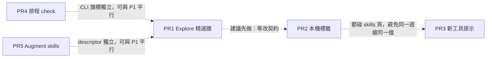

# aghub ← skills-hub：產品旅程優化路徑

**Date**: 2026-08-30
**Status**: Design — implementation-ready
**Scope crates**: `crates/desktop`（PR1–4 主體）、`crates/cli`（PR4）、`crates/desktop/src-tauri`（PR4 排程註冊）、`crates/agents` + `crates/core` tests（PR5）
**Origin**: sibling `../skills-hub` 深度對照（workflow `compare-skills-hub`，6 路調查 → 8 候選 → 對抗驗證剩 5 項）。完整對照稿：該 run 的 `scratch/skills-hub-vs-aghub.md`。
**Related**: `CONTEXT.md`（Master / Referrer / Relink / Resync）、`docs/specs/2026-06-19-symlink-only-skill-install.md`、`docs/specs/2026-06-20-skills-sources-unification.md`、`docs/adr/0001-transactional-universal-skill-rename.md`、skills `aghub-skills` / `npx-skills-contract`

> **Line-number convention.** 文中 `file:line` 是 2026-08-30 的錨點；實作時 `grep` 符號，不要死盯行號。

---

## Goal

把 skills-hub 驗證過、且**不破壞 aghub 不變量**的五段產品旅程接到現有縫上：精選牆、本機標籤、新工具提示、可選排程 check、補上 Augment 的 skills 洞。

做完之後 aghub 仍是「一次設定、多代理部署」的多資源控制台（桌面 + CLI + API），file-as-SSOT + Universal Master + npx lock 不變。使用者多得到的是圖書館式可發現性：冷啟動看得到精選、技能可標記、新裝的 CLI 會被問要不要掛 Referrer、關 App 仍能知道過期、Augment 真的讀得到已裝 skill。

**強烈偏好 incremental**：五個獨立 PR，照 Phase 順序，每個可單獨合併、單獨過測試。不要開「對齊 skills-hub」史詩，不要一次加 23 個 `AgentType`。

---

## Understanding

- **What**：五段獨立可合併的產品旅程，全部接到既有 ConfigManager / reconcile / `POST /skills/install` / `aghub-cli check`，不新開技能 SQLite，不改安裝模型。
- **Why**：對照後 **P0／P1 正確性漏洞為空**。aghub 的 lock／Resync／mutation lock／symlink-only 已經比 skills-hub 的 `remove_dir_all`+rename 嚴。skills-hub 贏在發現與覆蓋的 last-mile UX；Augment 是已上架代理的真實洞（descriptor 把 skills 全關，但 `skills_cli_name = Some("augment")`）。
- **Who**：用桌面管多個 coding agent skills 的人；CLI／CI 使用者只在 PR4 間接受益（排程跑的是 CLI）。
- **Non-goals**：見「明確不做」。

---

## Locked decisions（不要重開）

來自 symlink-only spec + npx 契約 + 本次對照驗證。實作時當硬約束，不當建議。

1. **Skill 安裝維持 symlink-only。** Master 物化可以 copy；NeedsLink 的 Referrer 是 Unix symlink / Windows `symlink_dir` 再 `mklink /J`。兩邊失敗是該代理 soft-fail，**不是** copy 後備。Cursor @global 是 NativeReader。iflow copy-mode 不 port。
2. **File-as-SSOT。** 真相是真實 agent 設定檔 + `.agents/skills/<name>` Master + npx lock（global v3 / project v1）。禁止用 SQLite `skills`／`skill_targets`／`tags` 或 `~/.skillshub` 當技能真相。inference 的 SQLite 只做 provider meta，不動。
3. **npx lock 契約凍結。** Source hash 演算法、`skillFolderHash` 刻意留空、project lock 無 timestamp，都不改。精選清單、標籤、排程結果都**不得**寫入 lock。
4. **突變走 ConfigManager。** 桌面不直呼 `link_agents_to_canonical`。新工具掛 Referrer 走既有 `POST /skills/reconcile`。安裝走既有 `POST /skills/install`。
5. **CLI `enable`／`disable` 維持 MCP-only。** `ConfigManager::set_skill_enabled` 繼續 `unsupported_operation`。本路徑不發明 skill enable／disable。NativeReader（Codex／OpenCode／Cursor／Cline／Warp @global）不能靠 unlink 假裝停用。
6. **未知 id 經 `registry::get()` 靜默變 Claude。** 新工具必須四步登記。自訂目錄不可進 registry。本路徑 **不**把 skills-hub 的 47 條適配器升級成 `AgentType`。
7. **`crates/skills-sh` 維持 search-only。** 精選是 catalog，不是 `market.rs` 第二個 `source=` 搜尋。
8. **排程只跑 check，預設不 Resync。** 不排 desktop binary（`tauri_plugin_single_instance` 會吞第二次啟動；API `GET /skills/check-updates` 會 `write_auto_healed_hashes`）。排 `aghub-cli check --online`。自動套用是未來獨立開關，必須等同 `--yes` 且只走 `resync_locked_skill`。
9. **破壞性預設 dry-run 不變。** `apply-update` 無 `--yes` 仍拒絕。
10. **跨行程 `MutationGuard` 不可繞過。** 排程／reconcile／install 都走既有持鎖路徑。
11. **一個 agent 讀自己的 dir + 映射的 Master，永不讀別的 agent 私有 dir。**
12. **路徑 SSOT 是 npx `agents.ts` + vendor + 已核過的 aghub descriptor，不是 skills-hub 的 `tool_adapters` 表。** 尤其：~~Antigravity 全域是 `.gemini/antigravity/skills`（不是 skills-hub 的 `.gemini/config/skills`）~~（**2026-09-06 推翻，見下**）；Trae 無 attested global skills（`UPSTREAM.md` `b95e1f61`）；OpenClaw 已 fallback clawdbot／moltbot，不當新 `AgentType`；Junie ≠ JetBrains AI。

    > **2026-09-06 修訂 — Antigravity 全域 skills 改為 `.gemini/config/skills`。**
    > 當初選 `.gemini/antigravity/skills` 是因為 npx `agents.ts` 這麼寫，而把
    > skills-hub 的 `.gemini/config/skills` 當成不可信的第二來源。重查後發現**這條
    > 決策自己排的 SSOT 順序就指向反面**：vendor 排在 `agents.ts` 前面，而 vendor
    > 現行文件明寫全域是 `.gemini/config/skills`。
    >
    > 證據：
    >
    > - `antigravity.google/docs/skills/`（現行合併頁）：全域
    >   `~/.gemini/config/skills/<skill-folder>/`，並註明「Available across all
    >   Antigravity products（Antigravity、Antigravity IDE、Antigravity CLI）」。
    > - Antigravity CLI（`agy`）二進位內嵌的官方 docs：「**Global Discovery**:
    >   `~/.gemini/config/`」，migrate 對照表寫 `~/.gemini/config/skills/<name>/SKILL.md`。
    > - `antigravity.google/docs/ide/skills/`（IDE 專頁，舊）仍寫
    >   `~/.gemini/antigravity/skills/`；`agents.ts` 抄的是這一個。
    > - `antigravity.google/docs/cli/plugins/`：CLI 另有
    >   `~/.gemini/antigravity-cli/skills/`。
    > - 旁證：同一個 descriptor 的 MCP 全域路徑早就是
    >   `.gemini/config/mcp_config.json`，`agy` changelog 也記載
    >   `~/.gemini/antigravity/mcp_config.json` 是 legacy 已 migrate 過去。
    >   skills 留在舊路徑等於同一個 descriptor 自相矛盾。
    >
    > 新形狀：**寫**入 `.gemini/config/skills`；**讀**三個都讀
    > （`.gemini/config/skills` → `.gemini/antigravity/skills` →
    > `.gemini/antigravity-cli/skills`），已發佈版本裝進舊路徑的技能不會被孤立。
    > 決策 #11（不讀別的 agent 私有 dir）不受影響 — 這三個都是 Antigravity 自己的。

---

## Assumptions（明示）

- 精選清單由**本 fork 維護**一份小而準的 bundled JSON（約 20–40 筆），不搬 skills-hub 那 300 筆（含 `summary: ">"` 的垃圾列），也不打對方 GitHub raw URL。
- 標籤與星標同一層限制：鍵是 skill **name**，不跟 rename／global↔project／remote 走。接受與 `starredSkills` 相同的撞名。
- 排程 v1 預設 **global scope**（`-g`）。排程 cwd 不是專案，不發明專案清單。
- 排程 v1 解析得到 `aghub-cli` 才允許打開開關；套裝桌面若沒有 CLI，toggle 停用並說明要裝 CLI 或填路徑。不為此把 CLI 塞進 desktop bundle（那是獨立 packaging 決策）。
- 新工具提示 v1 只處理 **global Master**。
- 本路徑不接桌面私有 repo 的 keyring 到 CLI check（CLI 仍是 `GIT_PASSWORD`／`GITHUB_TOKEN`）。私有來源大量 `Uncheckable{auth}` 是已知限制，另開 PR。

---

## 明確不做（本路徑禁止出現在 PR 裡）

1. 以 SQLite 或 `~/.skillshub` 取代 Master + lock。
2. symlink→junction→copy 三級 fallback、Cursor 強制 copy、copy-install 當預設。
3. 一次把 Goose／Continue／Qoder／DeepSeek Harness／Copaw…加成 `AgentType`。`clawdbot`／`moltbot`／`trae_cn` 不當新 id。
4. OS 排程在 App 關閉時對 git／local skill 直接 apply-update。
5. 用 GitHub repo search 當主探索（skills-hub 的 `search_github` 前端沒接；市集合約是 skills-sh）。
6. 把 featured 做成 `GET /skills-market/search?source=featured`。
7. 把 tree URL（`https://github.com/org/repo/tree/main/skills/foo`）丟進 `parse_github_repo_shorthand`。
8. 全體自動探測 `127.0.0.1:7890`，或把 github token 存 SQLite 回傳 renderer。
9. `custom-agents.tsx` 做成自訂 skill target 並塞進 registry（那頁仍是無後端 stub，本路徑不碰）。
10. 未託管 `SKILL.md` 掃描／discovery banner（doctor 不掃各 agent 私有目錄；真要做必須另開 spec，且只掃 descriptor 已登記路徑）。
11. NeedsLink「停用 = 只 unlink Referrer」。
12. 詳情檔案樹 + Markdown preview、list／cards 密度切換、HTTP proxy、git clone TTL cache——對照裡看得到，本輪不開工。
13. Zed skills 洞（npx 映射 `.agents/skills`，descriptor 全關）——獨立後續 PR，不要跟 Junie／Augment 混。

---

## 產品對照（只保留會驅動這五個 PR 的列）

| 缺口           | skills-hub                                        | aghub 現況                                              | 本路徑怎麼接                                   |
| -------------- | ------------------------------------------------- | ------------------------------------------------------- | ---------------------------------------------- |
| 冷啟動探索     | `ExplorePage.tsx` 空 query 畫 featured 卡         | `/skills-sh` 只有搜尋框（`pages/skills-sh/index.tsx`）  | PR1：同頁精選牆；安裝沿用 `InstallModal`       |
| 標籤           | SQLite `skill_tags` overlay                       | 只有 `starredSkills`                                    | PR2：`store.json` overlay                      |
| 新 CLI         | `NewToolsModal` + `sync_skill_to_tool`（含 copy） | coverage／reconcile 已能掛 Referrer，沒有「新出現」事件 | PR3：desktop 提示 → `POST /skills/reconcile`   |
| 關機仍 check   | 重開 GUI binary 直接套用                          | 進頁才 check，`staleTime=600_000`                       | PR4：排 `aghub-cli check --online`，寫 sidecar |
| Augment skills | `.augment/skills`                                 | `augmentcode.rs` skills 全關                            | PR5：打開 write path，NeedsLink                |

---

## 依賴圖

五個 PR **沒有程式碼依賴**，可以理論上平行。建議順序是產品風險由低到高，不是 build-order：



**合併衝突熱點（唯一要避開的）：**

- PR2 與 PR3 都會改 `pages/settings/skills.tsx`、`MultiSelectFloatingBar`、i18n。**不要同一週平行改同一檔**；PR2 先合併。
- PR1 只碰 `pages/skills-sh/**`，與 PR2／PR3 檔案面幾乎不重疊，可和 PR5 平行。
- 新 `store.json` key 用 `?? default`，**不 bump** `CURRENT_VERSION`（現在是 7）。避免兩個 PR 各寫一個 `v7-to-v8.ts`。星標當初在 `v3-to-v4.ts` 顯式 init；本路徑選擇「缺 key 當空」，與 `getStarredSkills` 的 `?? []` 一致、且不製造 version 鏈。

---

## 共用地基（每個只定義一次）

### 🧱 Featured catalog 形狀（PR1 擁有）

不是 `MarketSkill` 的第二個 API source。Catalog 是 **desktop 資料**：

```ts
type FeaturedSkill = {
	name: string; // 安裝時的 skill 名，對應 SKILL.md / 資料夾
	slug: string;
	summary: string;
	source: string; // 必須已是 install API 吃的形狀，例如 "github/anthropics/skills"
	author?: string;
	installs?: number; // 純展示，可 0
};
```

安裝時組出既有 `MarketSkill`（`slug`／`source`／`name`／`installs`／`author`）再交給 `useSkillInstall().handleInstallClick`。`source` 在 **寫 catalog 時**就轉成 `github/owner/repo`，執行期不做 tree-URL parse。

### 🧱 Desktop overlay keys（PR2／PR3／PR4 各加各的，互不遷移）

| key                        | 擁有者 | 預設                                    | 寫入時機                                      |
| -------------------------- | ------ | --------------------------------------- | --------------------------------------------- |
| `skillTags`                | PR2    | `{}` as `Record<string, string[]>`      | 使用者加／減標，且只在 skill 已存在於清單之後 |
| `lastKnownAvailableAgents` | PR3    | 缺 key = 首次，seed 後不彈窗            | 彈窗 Skip／Confirm 之後、以及首次 seed        |
| `skillCheckSchedule`       | PR4    | `{ enabled: false, interval: "daily" }` | Settings 開關                                 |
| sidecar 檔（不是 store）   | PR4    | 缺檔 = 尚未跑過                         | CLI `--write-result`                          |

Sidecar 路徑與 API 的 `app_data_dir` 對齊：`dirs::data_dir()/aghub/skill-check-last.json`（沒有 `data_dir` 則不寫、CLI 非零退出並說明）。桌面用既有 store 只存「排程開不開」，**不**把 check 結果當技能 SSOT。

### 🧱 Agent 過濾（PR3 擁有，純函式）

```ts
function newToolPromptDelta(args: {
	lastKnown: string[] | null; // null = 從未 seed
	available: AgentInfo[]; // is_available
	disabled: string[];
	coverageById: Map<string, AgentSkillCoverageDto>;
}): { seedOnly: string[] } | { prompt: string[] };
```

`prompt` 裡每一個 id 必須同時滿足：`AgentType` 可 parse、`is_available`、不在 `disabledAgents`、`supportsSkillMutation(agent, "global")`、`needsMasterLink(coverage) === true`。NativeReader 與 Unsupported 不進 prompt。

---

## Phase 1 — Explore 精選牆　`[M]`　獨立 PR

### 目前狀態（已查）

- `crates/desktop/src/pages/skills-sh/index.tsx`：垂直置中搜尋框，`q.length >= 2` 才 `setLocation('/skills-sh/search?q=')`。
- `search.tsx`：`TableVirtuoso` + lock 去重 `installedSet`（`source|name`）+ `InstallModal` + `useSkillInstall`。安裝 `POST /skills/install`，`source` 原樣來自 `MarketSkill.source`（skills.sh 形狀 `github/owner/repo`）。
- `crates/api/src/routes/market.rs`：未知 `source` 直接 400。`MarketSkill` 沒有 summary／stars。
- `crates/skills-sh`：search-only（`AGENTS.md` 反模式：禁止別的 crate 直打 skills.sh）。
- 全倉無 featured catalog。

### 設計

1. 新增 bundled JSON：`crates/desktop/src/data/featured-skills.json`（本 fork 維護，約 20–40 筆高訊號 skill：有真實 summary、`source` 已是 `github/owner/repo`、`name` 是 repo 內資料夾名）。
2. `pages/skills-sh/index.tsx`：搜尋框留下，**下方**改精選卡網格（空 query）。`>= 2` 字仍進現有 `/skills-sh/search`。不要把搜尋結果嵌進落地頁（YAGNI；search.tsx 已有虛擬列表與分頁）。
3. 卡片：name、summary（兩行截斷）、author／installs（有才顯示）、已裝 chip。已裝鍵重用 search.tsx 的 lock 查詢；把 `installedSet` 抽成 `pages/skills-sh/installed-set.ts`（純函式 + 一個 `*.test.ts`），兩邊 import。
4. 點卡片 → `useSkillInstall().handleInstallClick(asMarketSkill(entry))`。禁止新 install API。
5. 遠端刷新 **v1 不做**。bundled 就夠冷啟動。若以後要刷新，另開 PR：檔案快取 + 本 fork raw URL，fallback bundled；仍禁止 skills-hub raw URL，禁止新 SQLite。

### 檔案

- 新增 `crates/desktop/src/data/featured-skills.json`
- 新增 `crates/desktop/src/pages/skills-sh/featured.ts`（型別 + `asMarketSkill` + 過濾）
- 新增 `crates/desktop/src/pages/skills-sh/installed-set.ts` + `installed-set.test.ts`
- 新增卡片元件 `crates/desktop/src/pages/skills-sh/components/featured-card.tsx`
- 改 `index.tsx`、`search.tsx`（改 import `installed-set`）
- i18n：`en.ts` / `zh-Hans.ts` / `zh-Hant.ts`（精選區標題、已裝、空 summary fallback）

### 測試（必須能紅）

- `asMarketSkill`：`source` 不含 `/tree/`；缺 author 仍可安裝形狀。
- `installedSet`：同名不同 source 不算已裝；大小寫。
- catalog fixture 裡每一筆 `source` 匹配 `^github/[^/]+/[^/]+$`（或未來允許的 host-blind 形狀），沒有 tree URL。這條測試是防回歸：有人從 skills-hub JSON 原樣貼上來會紅。

### 驗收

- `/skills-sh` 無 query 看得到精選卡，不是 20vh 空白。
- 點未裝卡片打開既有 InstallModal，選代理後 Master + lock + Referrer 與從 search 安裝相同。
- 已裝卡片顯示 chip，仍可點開（idempotent reinstall 既有行為）。
- `GET /skills-market/search` 契約不變；`crates/skills-sh` 無新方法。

### 風險

- 把 catalog 誤做成第二個 market source → 拒絕。
- 精選品質：寧可 24 筆準，不要 300 筆爛 summary。

---

## Phase 2 — 本機標籤 overlay　`[S]`　獨立 PR（建議在 PR3 之前）

### 目前狀態（已查）

- 星標：`lib/store/stars.ts` + `hooks/use-favorites.ts`，鍵是 skill name。`SkillList` 已讀 `isSkillStarred`。
- `ListSearchHeader` 只有搜尋 + children slot。
- `MultiSelectFloatingBar` 可選 `onManageAgents`；skills 頁有傳 bulk agents（source 視圖），沒有 tag 動作。
- DTO／lock／SKILL.md frontmatter 皆無 tags。

### 設計

1. `lib/store/tags.ts`：`getSkillTags(): Record<string, string[]>`、`setSkillTags`。缺 key → `{}`。每個 value 去空白、去重、保留插入順序。
2. `hooks/use-skill-tags.ts`：比照 `useFavorites`（react-query key `skillTags`）。
3. `SkillList`：每列可顯示最多 N 個 tag chip；`ListSearchHeader` children 加 tag 篩選（含虛擬 **未標記**）。篩選是 **AND**：選了 tag 只顯示含該 tag 的 skill；未標記 = 沒有任何 tag。
4. 單列：在現有 overflow／detail 加「編輯標籤」；用既有 dialog 模式（小 modal，chip input，Enter 建立）。
5. 多選：`MultiSelectFloatingBar` 加可選 `onManageTags`。skills 頁傳入。動作：對選取 skill **加入**或**移除**一個 tag（一次一個 tag 名，避免做出技能-hub 那種完整 BulkTagsModal）。
6. 安裝加標：v1 **不做**（InstallModal 成功後自動加標是 follow-up）。先能對已在清單裡的 skill 標記就夠。
7. 禁止寫 lock、Master、frontmatter、ConfigManager、CLI／API route。

### 檔案

- 新增 `lib/store/tags.ts`、`hooks/use-skill-tags.ts`、`lib/skill-tags.ts`（純：`unionTags`、`matchesTagFilter`、`applyTagOp`）+ `lib/skill-tags.test.ts`
- 改 `skill-list.tsx`、`list-search-header` 的呼叫端 `pages/settings/skills.tsx`、`multi-select-floating-bar.tsx`
- 新增小 dialog `components/edit-skill-tags-dialog.tsx`
- i18n 三語

### 測試（必須能紅）

- `applyTagOp`：add 冪等、remove 缺 tag 是 no-op、空字串拒絕。
- `matchesTagFilter`：untagged 不含已標記；AND 語意。
- 不讀 lock fixture、不 assert 任何 API path。

### 驗收

- 重新打開 App tag 還在（store.json）。
- 篩選未標記／某 tag 只影響桌面清單，`aghub-cli get skills` 輸出不變。
- rename 後舊 name 的 tag 留在舊鍵（與星星相同限制；文件化，不當 bug）。

---

## Phase 3 — 新工具提示　`[M]`　獨立 PR

### 目前狀態（已查）

- `agents-panel.tsx` 只切 `disabledAgents`（`lib/store/agents.ts`）。
- 寫入面並非空白：`coverage.tsx`、`BulkManageGroupAgentsDialog`、`manage-skill-agents-dialog`、CLI／API `reconcile` 已能把 Master 掛到 NeedsLink 代理。
- `POST /skills/reconcile`（`routes/skills.rs`）+ `ReconcileRequest { source, added, removed, confirm }`。本提示只 **add**，`confirm` 可省略。
- `supportsSkillMutation`／`needsMasterLink` 已在 `lib/agent-capabilities.ts`。
- `classify.rs` 測試釘死 global NativeReader = `codex, opencode, cursor, cline, warp`。對這些提問會造成「產品上像沒掛、磁碟上 Master 已可見」。

### 設計

1. 在 `AgentAvailabilityProvider`（或 skills 頁 mount）算 `newToolPromptDelta`。
2. `lastKnownAvailableAgents: string[]`。**缺 key**：把當前過濾後的 available ids 寫入，**不彈窗**（避免老用戶升級後被 25 個代理洗版；skills-hub 空集合首次會把全部當 newly_installed，我們不學）。
3. 之後每次 available 集合穩定後：`prompt = currentEligible \ lastKnown`。空則把 currentEligible 寫回 lastKnown（CLI 被卸載時從 lastKnown 拿掉，之後重裝才會再問）。
4. Modal：列出新代理顯示名 + 「將為 N 個已裝 global skill 建立 Referrer」。按鈕：略過／掛上。
5. 掛上：對每個 global lock 裡的 skill name 呼叫既有 reconcile `added: promptIds`（重用 `buildReconcilePlans`／`reconcileSkills` mutation）。衝突槽 soft-fail，toast 彙總。全部嘗試完才更新 lastKnown。
6. 略過：只更新 lastKnown。
7. 禁止：desktop 直呼 linker、`SyncMode::Copy`、自訂 `skills_dir`、把未 parse 的 id 丟進 reconcile、為了這個功能加 Goose／Continue descriptor、對 NativeReader 提問、v1 處理 project Master。

### 檔案

- 新增 `lib/new-tool-prompt.ts` + `new-tool-prompt.test.ts`（delta 矩陣：首次 seed、NativeReader 排除、disabled 排除、卸載後重裝再問）
- 新增 `components/new-tools-modal.tsx`
- 改 `providers/agent-availability.tsx` 或 `onboarding-controller.tsx` 旁掛一個小 controller（不要塞進 3k 行的 skills 頁）
- i18n 三語

### 測試（必須能紅）

- 缺 lastKnown → `seedOnly`，prompt 空。
- lastKnown=`[]`、available 含 cursor（NativeReader）+ claude（NeedsLink）→ prompt 只有 claude。
- disabled 含 claude → prompt 不含 claude。
- 卸載 claude（available 不再有）→ lastKnown 下次寫入不含它；再出現時 prompt 含它。

### 驗收

- 新裝一個 NeedsLink CLI（例如本機本來沒有的 `claude`）再開 App，彈窗；確認後 `~/.claude/skills/<master-name>` 是指向 Master 的 symlink，lock 不變（reconcile 不該重寫 contentHash）。
- NativeReader CLI 新出現不彈窗。
- 略過後重開不再問同一個代理。

### 風險

- 對每個 skill 發一次 reconcile：skill 很多時會慢。v1 接受，顯示進度；不要為此新開 batch API（YAGNI，`core/src/batch.rs` 已有多目標政策，夠用再抽）。

---

## Phase 4 — 可選排程 check　`[M]`　獨立 PR（可與 PR1／PR5 平行）

### 目前狀態（已查）

- CLI `check`（`crates/cli/src/commands/check.rs`）：預設離線唯讀；`--online` 才 fetch；**從不寫 lock**（註解寫明 desktop API 才 self-heal）。`--json` 印 `SkillUpdateView[]` 到 stdout。
- API `GET /skills/check-updates`（`skills_update.rs`）online 路徑會 `write_auto_healed_hashes`。排程打這條會改 VCS 追蹤的 project hash。
- 桌面進技能頁才 check，`staleTime = 600_000`。Windows autostart 是 `--minimized`（`src-tauri/src/lib.rs`），關頁即停。
- 全倉無 launchd／schtasks／systemd／`--background-task`。

### 設計

1. **CLI**：`aghub-cli check skills --online -g --json --write-result <path>`。
    - `--write-result` 寫入 sidecar：`{ startedAt, finishedAt, online, scope, results: SkillUpdateView[], failed: number, updateAvailable: number }`。原子寫（temp + rename）。
    - 預設 path 若省略：`app_data_dir()/skill-check-last.json`。與 API `default_app_data_dir` 同一函式來源——**把 app_data_dir 抽到兩表面能共用的地方**（CLI 已有一份註解要求對齊 api；本 PR 若發現仍是複本，只加註解 + 測試釘路徑尾段 `aghub/skill-check-last.json`，不趁機做 #1 credential 大搬遷）。
    - check 本體仍唯讀。sidecar 失敗（磁碟滿）→ 非零退出，stdout JSON 仍印。
2. **排程註冊**（desktop-only，`src-tauri`）：
    - macOS launchd agent：`~/Library/LaunchAgents/com.aghub.skillcheck.plist`，`StartCalendarInterval` daily（v1 只 daily；weekly 是設定裡預留但不實作）。
    - Linux systemd --user：`~/.config/systemd/user/aghub-skillcheck.timer` + service。
    - Windows schtasks：`/SC DAILY`。
    - Program arguments：解析到的 `aghub-cli` 絕對路徑 + `check skills --online -g --json --write-result <sidecar>`。
    - **不**傳 `--yes`，**不**呼叫 apply-update，**不**啟動 desktop binary。
3. **解析 `aghub-cli`**：註冊當下 `which`／`where`；允許 Settings 填絕對路徑。找不到 → Switch disabled + 說明文案。不靜默成功。
4. **Settings → Application**（已有 autostart／updater）：加「定期檢查 skill 更新」開關。開 = 安裝 OS 任務；關 = 卸載。上次結果：讀 sidecar，顯示 `updateAvailable`／`failed`／`finishedAt`。點「現在檢查」仍走現有進頁 check（API），不要跟 sidecar 搶寫 lock。
5. 技能頁 badge：若 sidecar `updateAvailable > 0` 且比 react-query 的 `lastCheckedDate` 新，顯示「背景檢查發現 N 個更新」。點了仍進現有 apply 流程（使用者確認 + `--yes` 等價）。

### 檔案

- `crates/cli/src/commands/check.rs`：`--write-result`
- 新增 `crates/cli/tests` 或 check 模組測試：對假 results 寫 sidecar，assert 原子檔存在、JSON 可 parse、不碰 lock fixture
- `crates/desktop/src-tauri/src/commands/`：`get_skill_check_schedule`／`set_skill_check_schedule`／`get_last_skill_check`（讀 sidecar，路徑不回傳在 **error** 字串裡——AGENTS.md：API errors 不回傳任意內部 path；這裡是 Tauri command，仍避免把 temp 路徑塞進錯誤）
- 平台模組：`schedule_skill_check.rs`（launchd／systemd／schtasks），用 `CommandRunner` 風格以便測 plist／unit 內容
- `pages/settings/application-panel.tsx` + i18n
- 技能頁讀 sidecar 的小 hook

### 測試（必須能紅）

- `--write-result` 寫出的 JSON 含所有 view；目錄不存在時建立；目標是既有目錄（不是檔）時失敗且不刪該目錄。
- 排程 payload：**字串裡出現 `check` 與 `--online`，不出現 `apply-update`、`--yes`、`--background-task`。** 這條是防「整段搬 skills-hub auto_update」的回歸。
- plist／systemd unit 的 Program 是 `aghub-cli` 不是 desktop bundle 名。

### 驗收

- 打開開關後，對應 OS 任務存在；關掉後消失。
- 手動跑一次等價命令，技能頁看得到 sidecar 摘要。
- 跑完後 lock 的 `contentHash`／project `computedHash` 與跑前 **byte-identical**（check 唯讀）。

### 風險

- 把 `run_auto_update_now` 精神搬過來會在無 `--yes` 時改 Master。排程字串測試是閘門。
- 私有 repo：CLI 無 keyring → `Uncheckable`。文件化，不當本 PR 範圍。

---

## Phase 5 — 只修 Augment skills 路徑　`[S–M]`　獨立 PR（可與 PR1 平行）

### 目前狀態（已查）

```
crates/agents/src/agents/augmentcode.rs
  skills scopes: global false, project false
  global_skill_paths: None
  project_skill_paths: None
  skills_cli_name: Some("augment")
  from_str: "augmentcode" | "augment"
  MCP: ~/.augment/settings.json global-only（這段維持）
```

skills-hub／npx／vendor write path：`~/.augment/skills` 與 `<workspace>/.augment/skills`。aghub 現在完全不寫、不讀，所以在 Augment 裡「已裝」的 Master 是隱形的。

~~**不要**比照 `cursor.rs` 把 `~/.agents/skills` 加進 read paths。Cursor 加 Master 是因為 Cursor **真的**讀 `.agents/skills`，classify 會變成 NativeReader、**不**建 `~/.cursor/skills` Referrer。Augment CLI 只掃 `.augment/skills`；若誤標 NativeReader，Referrer 不會被建，洞補不上。~~

> **2026-09-06 作廢。** `LinkNeed::NativeReader` 已從
> `crates/core/src/skills/linker/classify.rs` 刪除 —— Master 搬到 `.aghub`
> 之後不再有「直接讀 Master」的情形，每個支援的 agent 都是 `NeedsLink`。把
> Master 加進 read paths **不會**抑制 Referrer 建立：grok / pi / copilot / omp
> 現在都這麼做。Augment 該不該讀 `.agents/skills`，現在純粹是 vendor 事實
> 問題，與 classify 無關。

Zed（`zed.rs` skills 全關、`skills_cli_name: None`）**本 PR 不碰**。

### 設計

1. 在 `augmentcode.rs` 用 `define_skill_paths!`（或手寫與 Claude 同形的 path fn）：
    - global read/write：`~/.augment/skills`
    - project read/write：`<root>/.augment/skills`
    - **read 集合不含** `~/.agents/skills`／`<root>/.agents/skills`
2. `capabilities.skills.scopes`：global `true`、project `true`；`universal: false`。
3. `project_markers`：現是 `&[]`，加上 `".augment"`（MCP 無專案檔，但 skills 專案目錄需要專案根偵測）。
4. MCP／sub-agents 能力不動。
5. `descriptor_regression.rs`：補 Augment skills 路徑斷言；`AgentType::ALL.len()` 不變（不是新 AgentType）。
6. `classify.rs`：加測試 `augmentcode`（及 alias `augment`）@global 與 @project 都是 `NeedsLink`，**不是** NativeReader、**不是** Unsupported。
7. 不讀 `.claude/skills`。不新 id。不把 skills-hub 的 `trae_cn`／`clawdbot` 順手帶上。

### 檔案

- `crates/agents/src/agents/augmentcode.rs`
- `crates/agents/tests/descriptor_regression.rs`
- `crates/core/src/skills/linker/classify.rs` 測試
- 若 desktop 有寫死「Augment 不支援 skills」的文案／coverage 空態，改為跟其他 NeedsLink 一樣（grep `augment` 在 desktop locales 與 `agent-capabilities.test.ts`）

### 測試（必須能紅）

- 路徑：global write `~/.augment/skills`，project write `<root>/.augment/skills`。
- classify：NeedsLink both scopes。
- **負向**：read paths 的測試必須在「home 含 `.agents/skills`」時仍是 NeedsLink。若有人「順手」抄 cursor 的 master-in-read，這條會紅。
- 既有 MCP 測試（`~/.augment/settings.json`）仍過。

### 驗收

- 對一個已有 global Master 的 skill：`aghub-cli`／desktop reconcile 把 `augmentcode` 加進去後，`~/.augment/skills/<name>` 是指向 `~/.agents/skills/<name>` 的 symlink。
- `aghub-cli get skills -a augmentcode -g` 看得到該 skill。
- coverage 矩陣該格可點。

### 後續（本路徑外，各開一 PR）

- Zed skills：對 npx `.agents/skills` 核過再決定 NativeReader vs NeedsLink。
- Junie：skill-path-only，`.junie/skills`，不得取代 jetbrains-ai。
- Continue／Goose／Crush／OpenHands：npx + vendor 核過才進 `ALL`。npx 沒有的（deepseek_harness、copaw、qoderwork、openclaude…）預設不加。

---

## Key Decisions

| #   | 決策                                             | 替代方案                                    | 為什麼選這個                                                                           |
| --- | ------------------------------------------------ | ------------------------------------------- | -------------------------------------------------------------------------------------- |
| D1  | 五個獨立 PR，不開史詩                            | 一個「skills-hub parity」PR                 | 檔案面幾乎不重疊；史詩會把 catalog UX 和 descriptor 正確性綁在一起，review 不可審計    |
| D2  | 精選是 bundled catalog，不是 market `source=`    | API 新 source；打 skills-hub raw            | `skills-sh` 維持 search-only；對方 JSON 品質差且 tree URL 會污染 install               |
| D3  | 標籤只在 `store.json`                            | 寫 frontmatter／lock                        | npx hash 會變；CLI／遠端／其他 agent 讀不到 frontmatter tag 是技能內容，不是使用者分類 |
| D4  | 新工具提示走 reconcile，lastKnown 缺 key 只 seed | 空 lastKnown 當「全部新出現」（skills-hub） | 升級後對老用戶彈 20+ 代理是騷擾；primitive 已存在，缺的是可發現性                      |
| D5  | Augment **NeedsLink**，read 不含 Master          | 比照 cursor 把 Master 加進 read             | Augment 不讀 `.agents/skills`；NativeReader 會跳過 Referrer，洞補不上                  |
| D6  | 排程跑 CLI check，不跑 desktop、不 apply         | 重開 GUI binary 做 `update_managed_skill`   | single_instance、API self-heal、dry-run 預設、skills-hub swap 無 mutation lock         |
| D7  | 新 store key 不 bump `CURRENT_VERSION`           | 每個 overlay 一個 migration                 | 避免 PR2／PR3 搶 v8；`?? default` 與現有 `getStarredSkills` 一致                       |
| D8  | 本路徑不發明 skill enable／disable               | unlink Referrer 當停用                      | NativeReader 仍讀 Master；`set_skill_enabled` 已明示 unsupported                       |

---

## PR Plan

每個 PR 獨立可 review、可合併。標題用繁中 + 範圍前綴，方便 `git log`。

### PR1 — `feat(desktop): skills-sh 精選牆`

- **影響**：`crates/desktop/src/pages/skills-sh/**`、`crates/desktop/src/data/featured-skills.json`、locales
- **依賴**：無
- **內容**：bundled catalog、落地頁卡片、`installed-set` 抽取、點擊走既有 InstallModal
- **Gate**：desktop typecheck；`installed-set.test.ts`；catalog source 形狀測試

### PR2 — `feat(desktop): skill 本機標籤 overlay`

- **影響**：`lib/store/tags.ts`、`hooks/use-skill-tags.ts`、`skill-list.tsx`、`skills.tsx`、`multi-select-floating-bar.tsx`、locales
- **依賴**：無（建議先於 PR3 合，減少 `skills.tsx` 衝突）
- **內容**：store overlay、篩選、單列編輯、多選加減一個 tag
- **Gate**：`skill-tags.test.ts`；確認無 lock／API 變更（`git diff crates/skill crates/api` 應空）

### PR3 — `feat(desktop): 新可用代理時詢問是否 reconcile`

- **影響**：`lib/new-tool-prompt.ts`、`new-tools-modal.tsx`、availability／controller、locales
- **依賴**：建議 PR2 已合（檔案衝突，不是邏輯依賴）
- **內容**：delta 純函式、首次 seed、modal、reconcile add-only
- **Gate**：`new-tool-prompt.test.ts` 矩陣；手動：NeedsLink 出現才問

### PR4 — `feat(cli,desktop): 可選 OS 排程只跑 check`

- **影響**：`crates/cli/src/commands/check.rs`、`crates/desktop/src-tauri/**`、`application-panel.tsx`
- **依賴**：無
- **內容**：`--write-result`、平台排程註冊、Settings 開關、sidecar 摘要
- **Gate**：sidecar 測試；排程 payload 禁止 `apply-update`／`--yes`；lock 跑完前後一致

### PR5 — `fix(agents): Augment 打開 .augment/skills（NeedsLink）`

- **影響**：`augmentcode.rs`、`descriptor_regression.rs`、`classify.rs` tests、可能 locales
- **依賴**：無
- **內容**：path fn + capabilities + markers；classify 負向測試防 Master-in-read
- **Gate**：`cargo test -p aghub-agents`、`cargo test -p aghub-core classify`；手動 reconcile 出 symlink

---

## 建議落地週序

不是硬依賴，是注意力排序：

1. **週序 A（可平行）**：PR1 精選牆 + PR5 Augment。一個可見、一個正確性。
2. **週序 B**：PR2 標籤。
3. **週序 C**：PR3 新工具提示（skills 頁已穩）。
4. **週序 D**：PR4 排程 check（OS 整合，單獨測 macOS／Linux／Windows 任務）。

---

## 明確的後續（寫在這裡以免混進上述 PR）

這些在對照的 `borrowable` 裡，驗證後**不當本路徑開工**：

- 未託管 `SKILL.md` 掃描（另開 spec：只掃 descriptor 已登記路徑，經 ConfigManager 安裝，doctor 不擴大）
- skill 詳情檔案樹 + Markdown
- list／cards 密度
- 可選 HTTP proxy（不可連同自動探 7890）
- git clone TTL cache（cache 只能當 Fetched Source）
- Zed／Junie／Continue／Goose… 各一 PR
- CLI check 接 keyring／SourceAuth
- 排程自動 apply（獨立開關 ≡ `--yes` + `resync_locked_skill`）
- `custom-agents.tsx` 真做（不可進 `AgentType`；若做，是「自訂 skills 目錄 overlay」，另開 spec）

---

## 實作偏離（落地後補記，2026-08-31）

四段旅程都已落地（PR1／PR2／PR3／PR4／PR5 全部），以下是與上文有意識的差異，
不是遺漏：

1. **`app_data_dir` 的 fallback 不 fail-closed。** 上文「沒有 `data_dir` 則不寫、
   CLI 非零退出」沒有照做：`dirs::data_dir().unwrap_or_else(temp_dir)` 是
   `aghub-api` 與 `aghub-cli` **既有的共用公式**，同時也是 inference SQLite 的
   根。只為 sidecar 改它會動到不相干的東西，超出本路徑範圍。要改請另開 PR，
   對三個表面一起改。
2. **Settings 沒有「現在檢查」按鈕。** 技能頁本來就有一顆重新整理跑同一條 API
   check，再加一顆是重複的入口。背景結果改成在技能頁顯示可點的提示列。
3. **標籤篩選不在 `ListSearchHeader` 的 children 裡**，改成 header 下方獨立一列。
   那個 children 區是 `shrink-0` 的按鈕列，塞可變數量的 tag chip 會擠爆版面。
   沒有任何標籤時整列不渲染。
4. **排程的 macOS／Windows 只驗到「OS 接受之前」。** 三個 backend 都走可注入的
   `Env`，在 Linux 上驗過寫了哪個檔、下了哪些指令、被拒絕的 payload 不落地；
   launchd／Task Scheduler 本身接不接受那份定義沒有機器可驗。Linux 有一個
   `#[ignore]` 的真機測試（`cargo test -p aghub -- --ignored`）。
5. **`useEffect` 用來把 seed 寫進持久層。** `crates/desktop/AGENTS.md` 禁的是
   「用 `useEffect` 取資料或同步 state」;這裡是把衍生結果寫進**外部系統**
   (`store.json`),那是 effect 本來就該做的事,而且沒有第二個地方可以掛。
   已加上 cancelled 旗標與失敗不記錄 fingerprint。若之後要拿掉,得先有一個
   「delta 變化時觸發一次持久化」的非 effect 機制。
6. **Tauri capabilities 沒有為新指令加 ACL。** 這個 repo 目前對 `generate_handler`
   的 app command 一律不掛 ACL（`start_server`／`connect_remote` 等都沒有），
   新指令沿用同一慣例。要收緊是整個 repo 一起導入 ACL 的獨立工作，不是這四個
   指令的問題。

## Open questions

本 spec 已用 Assumptions 鎖預設。若要改預設，在實作前改這裡，不要在 PR 裡臨場發揮：

1. 精選清單要不要公開成 raw URL 給桌面刷新？（預設：v1 不刷新）
2. 排程 v1 要不要支援 project scope？（預設：不要，cwd 不可靠）
3. 標籤鍵要不要改成 `scope::name` 避免 global／project 撞名？（預設：不要，跟星星一致）

沒有需要擋住實作的未決題。預設即決策。
